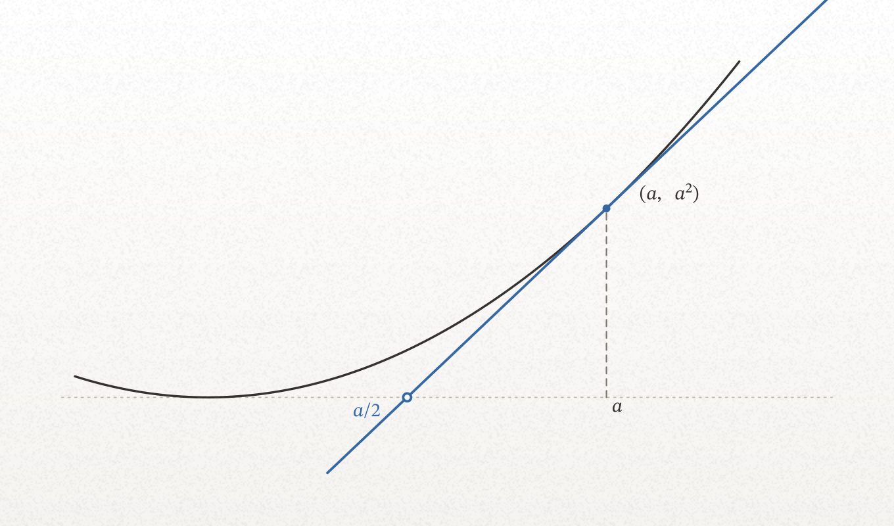

<p align="center">
  
</p>

<p align="center"><b>The procedure that decides what to draw, and the compiler that checks what got drawn.</b></p>

<p align="center">
  <a href="#quickstart">Quickstart</a> ·
  <a href="#gallery">Gallery</a> ·
  <a href="#what-gets-decided-before-any-code">How it decides</a> ·
  <a href="#what-the-compiler-checks">What it checks</a> ·
  <a href="docs/skill.md">Docs</a>
</p>

<p align="center">
  <a href="figures/out/GALLERY.md"></a>
</p>

<p align="center"><sub><b>Why a real Taylor series stops converging at a radius nothing on the real line explains.</b><br>
The graph of 1/(1+x²) is the tranquil real slice of a surface that erupts at z = ±i. The radius is the distance to the poles you cannot see.</sub></p>

---

A plotting library starts work after the two decisions that determine whether
the figure was worth making: **what to draw**, and **whether what got drawn is
true**. matplotlib will cheerfully render an arrowhead pointing the wrong way,
at 6 pt, in a yellow that vanishes on the page. It has no opinion, because it
was never told what the picture is supposed to argue.

figlib is the layer above. Two halves, and both are load-bearing:

- **A design procedure** — ten steps, run before any code, that turn "I need a
  figure of X" into a claim, a representation, a page slot, a reading order,
  and a gate plan. This is the part that decides quality, and it is written to
  be executed by a model, not admired by a human.
- **A compiler** — the figure is a program that computes its own geometry and
  declares assertions about it. `compute → build → autoplace → gates → render`
  emits SVG and PNG, and refuses to emit anything that fails.

The loop closes because every gate returns a *computed fix* rather than a
complaint, and the last gate is a second model reading the PNG cold. An agent
can drive the whole thing — propose, check, repair, verify by re-reading —
without a human in the middle deciding whether the picture looks right.

It ships as the `scientific-figures` skill, so the procedure travels with the
library into any project on the machine.

## Install

Python 3.12+, [uv](https://docs.astral.sh/uv/), and cairo.

```bash
brew install cairo          # or your platform's cairo
git clone https://github.com/Nirtzur0/figlib && cd figlib
uv sync && make test
```

To author figures from *other* projects without those projects depending on
figlib, install the checker as a standalone tool — `figcheck` then loads a
figure program into its own environment and writes next to it:

```bash
uv tool install --editable .
```

## Quickstart

A figure is one module. This is the whole of
[`docs/examples/first_figure.py`](docs/examples/first_figure.py) — nothing
elided:

```python
CLAIM = ("The tangent to y = x^2 at x = a meets the axis at a/2 — the "
         "subtangent is half the abscissa, for every a.")

EXPOSITION = """..."""             # the passage this figure is FOR

FORMAT = COLUMN                    # MARGIN 340 | COLUMN 680 | WIDE 1000 px
THEME  = RISO
PARAMS = {"a": 1.5, "xlim": (-0.55, 2.35), ...}   # no magic numbers below

def compute(p):                    # numerics -> arrays. No drawing decisions.
    a, r = p["a"], p["reach"]
    x = np.linspace(*p["curve_x"], 400)
    t = np.array([a - r, a + r])
    return {"parabola": np.column_stack([x, x * x]),
            "tangent":  np.column_stack([t, 2.0 * a * (t - a) + a * a]),
            "foot": (a, a * a), "p": p}

def build(g):                      # arrays -> Scene. Roles, never colors.
    s = Scene(xlim=..., ylim=..., height_px=400)
    s.add(Curve(g["parabola"], role=Role.CONTENT))
    s.add(Curve(g["tangent"],  role=Role.ACCENT1))
    s.add(Point(g["foot"], filled=True, role=Role.ACCENT1))
    s.add(MathLabel(r"a/2", (a / 2.0, 0.0), ha="right", va="top"))
    return s

def assertions(g):                 # the gate, on the arrays that got drawn
    (x0, y0), (x1, y1) = g["tangent"]
    root = x0 - y0 * (x1 - x0) / (y1 - y0)     # where the DRAWN line hits y=0
    assert abs(root - g["p"]["a"] / 2.0) < 1e-12
```

```
$ make check F=docs/examples/first_figure.py

[PASS] first_figure: The tangent to y = x^2 at x = a meets the axis at a/2 …
  svg: docs/examples/out/first_figure.svg
  png: docs/examples/out/first_figure.png
  placed: '(a,\,a^2)' offset_px += (+19, +0)
  placed: 'a/2' offset_px += (-19, +0)
```

<p align="center">
  
</p>

Note what the assertion does *not* do: it never recomputes `a/2` from theory
and compares it to itself. It reads the endpoints of the line that was
actually drawn, solves for where that segment crosses the axis, and checks
*that*. Every assertion in the corpus is written this way — against the
plotted arrays, so a build error and a math error both surface as a failure.

## What gets decided before any code

The design step, in full, is in
[`docs/architecture.md`](docs/architecture.md#the-thinking-layer-what-actually-decides-quality);
the reasoning behind each step is in [`docs/exposition.md`](docs/exposition.md).
The shape of it:

| step | the question it forces |
|---|---|
| **0 · earn it** | write the prose that makes the figure unnecessary. If the prose works, no figure. |
| **1 · claim** | one sentence the figure *argues*. Can't write it? There is no figure yet. |
| **2 · representation** | which primitive makes the claim checkable by eye — and at which rung: instance, trajectory, family, behavior map? |
| **3 · slot** | MARGIN, COLUMN or WIDE. Chosen *with* the annotation budget, never after. |
| **4 · traversal** | where the eye enters, what path adjacency forces, what a 3-second glance yields versus a 30-second study. |
| **5 · mechanism** | which quantities a cold reader must read *off* the figure to reconstruct the argument. |
| **6 · reader effort** | which verification is delegated to the reader, and which single inference is kept for them. |
| **7 · channels** | claim structure onto theme channels: hue = correspondence, lightness = order, accent = *the* object. |
| **8 · honesty** | what the depiction lies about — truncated infinities, selected seeds, unequal panel scales — plus the accidental assertions layout makes for free. |
| **9 · gate plan** | which numerical assertions certify the geometry, and what the cold readback should say. |

This is the part that isn't a plotting library. Steps 0 and 1 routinely
conclude that the figure should not exist; step 2 is where a good figure and a
competent one diverge; step 8 is the one nobody does by hand. Encoded as
prompts, they are cheap to run every time, which is the only reason they get
run at all.

## What the compiler checks

| gate | what it holds |
|---|---|
| **numerical** | the program's own assertions, on the arrays that were drawn |
| **mechanical** | label collisions, clipping, type under 8.5 pt, annotation over 22% of the canvas |
| **color** | correspondence hues pairwise separable · an order ramp monotone in lightness · ink clearing a contrast floor on the actual ground |
| **golden regression** | rendering is byte-deterministic, so any diff against the committed baseline is a real change |
| **readback** | a cold agent sees only the PNG and says what it claims; if that misses `CLAIM`, the figure is wrong however pretty it is |

Every mechanical diagnostic carries a *computed* fix, not a complaint — the
difference between a message a human interprets and one an agent can apply:

```
[FAIL] poincare_disc: …
  label-collision: "L" overlaps "P" by 11px — offset_px += (+0, -13)
  clipping: geodesic overruns the frame by 4.2px on the right
```

When a fix becomes fully computable it stops being a gate and moves into the
pipeline. Collision nudges did: `autoplace` now applies the solved offset
before the gate measures. What's left in the mechanical gate is what a solver
shouldn't silently fix — a pinned label whose position *is* meaning, a move
past the 24 px budget, which is a design defect wearing a layout defect's
clothes.

## Semantics, not appearance

`Role.CONTENT`, `theme.ramp(t)`, `theme.categorical(i)`, `theme.surface_shade(t)`.
No figure in this repo contains a hex literal, a font name, or a stroke width.

That is not tidiness. It is what makes the color gate possible: because a
color arrives carrying its *channel* — ordered, categorical, cyclic, depth —
the gate can hold each to its own standard. A ramp must be monotone in
lightness; a categorical set must be pairwise separable; neither test means
anything applied to an anonymous `#4c72b0`. It also means one theme edit
restyles the corpus, and a figure that quietly stops retheming is a bug the
corpus can find.

A figure is a printed page. The default ground is the RISO theme's white
stock with its grain — and grain is **ink, not paper**, so it rides the
groundless render too. Every figure commits both: `<name>.svg` on the stock,
and `<name>_transparent.svg` on alpha for a document that owns its own
background. `figcheck` checks both unconditionally, because a contrast gate
only earns its keep on a ground that is actually there.

## Gallery

<!-- gallery:start -->

**36 figures.** Every thumbnail links to its claim, the passage it serves, and both renders — or browse [the full gallery](figures/out/GALLERY.md).

### complex

*Conformal maps, the Riemann sphere, contour integration.*

<p><a href="figures/out/GALLERY.md#amplitwist"></a> <a href="figures/out/GALLERY.md#contour_deformation"></a> <a href="figures/out/GALLERY.md#demo_flow_past_cylinder"></a></p>

<p align="center"><a href="figures/out/GALLERY.md#demo_panels_zsquared"></a></p>

<p align="center"><a href="figures/out/GALLERY.md#demo_sphere_stereographic"></a></p>

<p align="center"><a href="figures/out/GALLERY.md#fig09_exp_series_spiral"></a></p>

<p><a href="figures/out/GALLERY.md#inversion_in_circle"></a> <a href="figures/out/GALLERY.md#mobius_classification"></a> <a href="figures/out/GALLERY.md#poincare_disc"></a></p>

<p align="center"><a href="figures/out/GALLERY.md#vca_fig12_flow_grid"></a> <a href="figures/out/GALLERY.md#vca_fig14_volcanoes"></a></p>

<p><a href="figures/out/GALLERY.md#vca_fig30_elliptic_checkerboard"></a> <a href="figures/out/GALLERY.md#vca_fig4_zn_polar_grid"></a></p>

<p><a href="figures/out/GALLERY.md#vca_fig9_cassinian"></a> <a href="figures/out/GALLERY.md#winding_number"></a></p>

### signals

*Sampling, spectra, and the geometry of transfer functions.*

<p align="center"><a href="figures/out/GALLERY.md#dft_matrix_basis"></a> <a href="figures/out/GALLERY.md#polezero_response"></a></p>

<p align="center"><a href="figures/out/GALLERY.md#sampling_aliasing"></a></p>

### linalg

*Matrices as geometry: the four readings, low rank, conditioning.*

<p align="center"><a href="figures/out/GALLERY.md#conditioning_ellipse"></a> <a href="figures/out/GALLERY.md#matrix_four_views"></a></p>

<p><a href="figures/out/GALLERY.md#svd_low_rank"></a></p>

### dynamics

*Flows, bifurcations, and stochastic trajectories.*

<p align="center"><a href="figures/out/GALLERY.md#demo_basin_wash"></a> <a href="figures/out/GALLERY.md#demo_ou_ensemble_field"></a></p>

<p align="center"><a href="figures/out/GALLERY.md#diffusion_ode_vs_sde"></a></p>

<p align="center"><a href="figures/out/GALLERY.md#saddle_node_behavior_map"></a> <a href="figures/out/GALLERY.md#strogatz_saddle_node"></a></p>

### optim

*What actually governs convergence.*

<p align="center"><a href="figures/out/GALLERY.md#illconditioned_descent"></a></p>

### probability

*Densities under maps, and where the mass really lives.*

<p align="center"><a href="figures/out/GALLERY.md#concentration_of_measure"></a></p>

<p align="center"><a href="figures/out/GALLERY.md#prml_polyfit_multiples"></a> <a href="figures/out/GALLERY.md#pushforward_density"></a></p>

### statmech

*Order parameters and phase transitions.*

<p align="center"><a href="figures/out/GALLERY.md#ising_transition"></a></p>

### infotheory

*Typicality, and why the mode is not the story.*

<p align="center"><a href="figures/out/GALLERY.md#typical_set"></a></p>

### circuits

*Transformer internals as computation graphs.*

<p align="center"><a href="figures/out/GALLERY.md#induction_head_circuit"></a> <a href="figures/out/GALLERY.md#qk_circuit_tensor"></a></p>

<p><a href="figures/out/GALLERY.md#qk_score_derivation"></a></p>

<p align="center"><a href="figures/out/GALLERY.md#schematic_transformer_block"></a></p>

<!-- gallery:end -->

## Commands

```
make test                            pytest
make check F=figures/optim/x.py      render + every gate, exit 1 on failure
  F="figures/optim/x.py --report"    + a textual layout inventory
  F="figures/optim/x.py --transparent"   ink on alpha instead of the stock
make regress                         corpus-wide golden diff
make update                          refresh the committed baselines
make gallery                         regenerate GALLERY.md + this README grid
make brand                           redraw the wordmark, mark and social card
```

The Makefile exports cairo's library path; a bare `uv run figcheck` misses it
and fails opaquely.

## Layout

```
src/figlib/     the library — flat modules, one per concern
                (see figlib/__init__.py for the map)
figures/<subject>/*.py
                the corpus: complex · signals · linalg · dynamics · optim ·
                probability · statmech · infotheory · circuits
figures/out/    committed render baselines, both grounds, plus readback records
docs/           skill.md (how to write a figure) · architecture.md (the stack,
                and the design step) · grammar.md · exposition.md
                brand/ — the wordmark and social card, drawn by the library
                they brand (same ink, same grain, same math face)
tests/
```

Start at [`docs/skill.md`](docs/skill.md). It is short, and it is the contract.
