# Figure gallery

36 figures. Generated by `make gallery` — **do not edit.**

Each card shows the default render on the theme's white stock; the `_transparent` SVG is ink on alpha, for embedding in a document that owns its own ground.

## complex

*Conformal maps, the Riemann sphere, contour integration.*

### amplitwist

**Claim.** An analytic map with f'(z0) != 0 amplifies and twists an infinitesimal disc by the SAME factor and angle in every direction (an amplitwist); a non-analytic R^2 -> R^2 map with unequal singular values does not, and sends the disc to an ellipse instead.

Chapter 4 of Visual Complex Analysis, "The Amplitwist Concept," is where
Needham finally commits to what "complex differentiable" should mean
geometrically, having spent three chapters building the vocabulary of
maps-as-transformations. The naive route -- treat f as a map R^2 -> R^2
and demand its Jacobian exist -- buries the interesting fact inside a
2x2 matrix. Needham's move is to notice that when f'(z0) exists and is
nonzero, that Jacobian is not an arbitrary linear map: it is
multiplication by the single complex number f'(z0), which stretches
every direction by the same factor |f'(z0)| and rotates it by the same
angle arg f'(z0). He names this one number the amplitwist and only
afterward shows it is equivalent to the Cauchy-Riemann equations -- the
algebra is a corollary of the geometry, not the other way round. The
reader is asked to accept, on the strength of a picture of one arrow
turning into another, that a generic smooth map does NOT have this
property; nothing in the prose forces that belief.

This figure is the falsification the chapter's prose does not attempt:
the same disc-of-arrows construction run once on an analytic map and
once on a real-linear map with unequal axis stretches, so "same
amplitwist in every direction" and "different amplitwist by direction"
sit side by side as two outcomes of one procedure, not as a claim and
its unstated opposite.

[svg](complex/amplitwist.svg) · [transparent svg](complex/amplitwist_transparent.svg) · [readback](complex/amplitwist.readback.md)

---

### contour_deformation

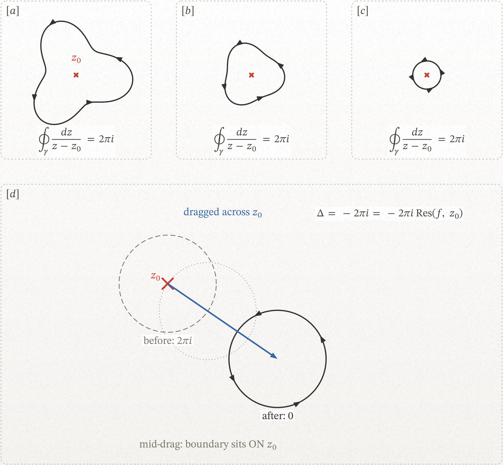

**Claim.** The integral of f(z) = Res/(z - z0) around a closed loop depends only on the loop's homotopy class relative to z0, not on its shape: three visibly different loops enclosing z0 all carry the identical value 2 pi i * Res, while dragging that same loop bodily across z0 instead of shrinking it around z0 changes the value discontinuously, by exactly 2 pi i * Res, at the one instant the boundary sweeps over the pole.

Chapter 8's Deformation Theorem (Visual Complex Analysis, "Complex
Integration: Cauchy's Theorem," section VI.3, "General Contours and the
Deformation Theorem") fixes a gap left by Cauchy's Theorem itself: that
theorem forces the integral of an analytic function around a closed
loop to vanish, but only inside a region with no singularity in it -- it
says nothing about a loop that legitimately encircles a pole. Needham's
fix is the rubber-band-and-peg picture: treat the contour as elastic,
the singularity as a peg sticking out of the plane, and note that the
value of the integral cannot change as the band is stretched, so long
as it is never forced across the peg. Two loops of wildly different
shape but the same class -- same peg inside, wound around it the same
number of times -- must therefore carry the same integral, and dragging
a loop bodily across the peg instead of shrinking it around the peg is
exactly the one move the theorem forbids, because the argument breaks
down at the instant the boundary passes over the singularity.

This figure stages both halves of that claim rather than asserting
them: three visibly different loops enclosing the same pole print the
identical value 2*pi*i*Res, and a fourth panel performs the forbidden
move -- dragging [c]'s exact loop across the pole -- so the reader
watches the value jump by exactly the residue term at the one instant
the deformation theorem's hypothesis fails.

[svg](complex/contour_deformation.svg) · [transparent svg](complex/contour_deformation_transparent.svg) · [readback](complex/contour_deformation.readback.md)

---

### demo_flow_past_cylinder

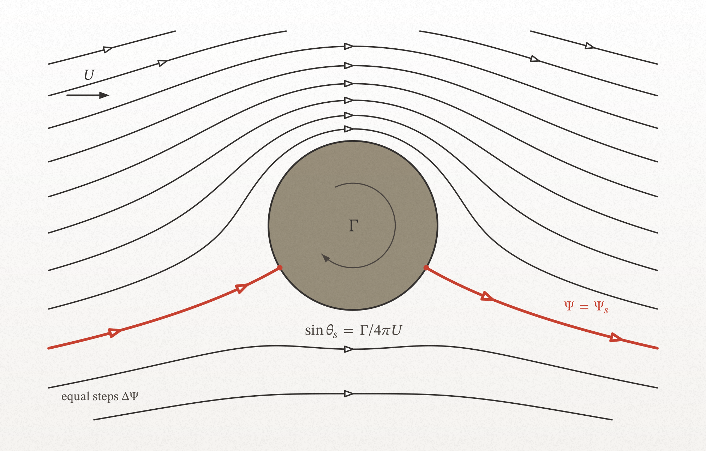

**Claim.** Circulation slides both stagnation points down the cylinder to sin(theta_s) = Gamma/4piU and crowds the equally spaced Psi-levels over the top: the flux-tube density is the speedup that generates lift.

Needham reaches this picture two figures after establishing the totally
irrotational flow round the disc (VCA, "Flows and Harmonic Functions,"
Fig [12]): Omega = U(z + 1/z), no circulation, stagnation points sitting
symmetrically at +-1. He then superposes a vortex term
-i*Gamma/(2pi) log z -- Fig [13] -- and reports, without derivation, that
the two stagnation points slide toward each other along the circle as
|Gamma| grows, coalescing at i for one critical value and then leaving
the circle altogether (Fig [14], a qualitatively different flow). The
reader is left to take the sliding on faith. This figure is the picture
that makes sin(theta_s) = Gamma/(4 pi U) checkable: circulation at a
value short of coalescence, the two stagnation points visibly displaced
but still on the cylinder, and the equally spaced Psi-levels crowding
over the top -- the same equal-increment k-cells from the complex-
potential construction, now compressed on one side, which is the
geometric content of lift before any mention of the Kutta-Joukowski
theorem.

[svg](complex/demo_flow_past_cylinder.svg) · [transparent svg](complex/demo_flow_past_cylinder_transparent.svg) · [readback](complex/demo_flow_past_cylinder.readback.md)

---

### demo_panels_zsquared

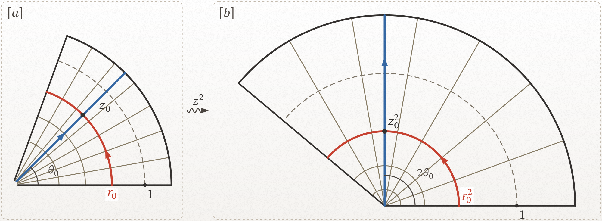

**Claim.** The mapping z -> z^2 doubles every angle and squares every modulus: a polar sector of opening theta_max maps to one of opening 2*theta_max, the ray at theta_0 lands on the ray at 2*theta_0, the circle of radius r_0 < 1 contracts to radius r_0^2, and the unit circle maps to itself.

Needham introduces z -> z^n (VCA ch. 2, "Polynomials," section "Positive
Integer Powers," Fig [4]) as the first mapping the reader is asked to
picture rather than compute: writing z = r e^{i theta}, w = r^n e^{in
theta}, so a ray at angle theta lands on the ray at n*theta and a circle
of radius r lands on the circle of radius r^n. Needham's own figure runs
n = 3 on a handful of rays and arcs and leaves the general case to the
reader; this pair specializes to n = 2 and asks the domain and codomain
panels to carry the argument by correspondence rather than assertion --
the same ray, the same circle, tracked by hue across both panels, landing
exactly where the formula says. The unit circle is drawn as the one curve
that does not move, because r = r^2 only at r = 1: it is the fixed set of
the family, and the panel widths are set so it renders at the same size
on both sides, so "maps to itself" is something the eye checks rather
than something the caption asserts.

[svg](complex/demo_panels_zsquared.svg) · [transparent svg](complex/demo_panels_zsquared_transparent.svg) · [readback](complex/demo_panels_zsquared.readback.md)

---

### demo_sphere_stereographic

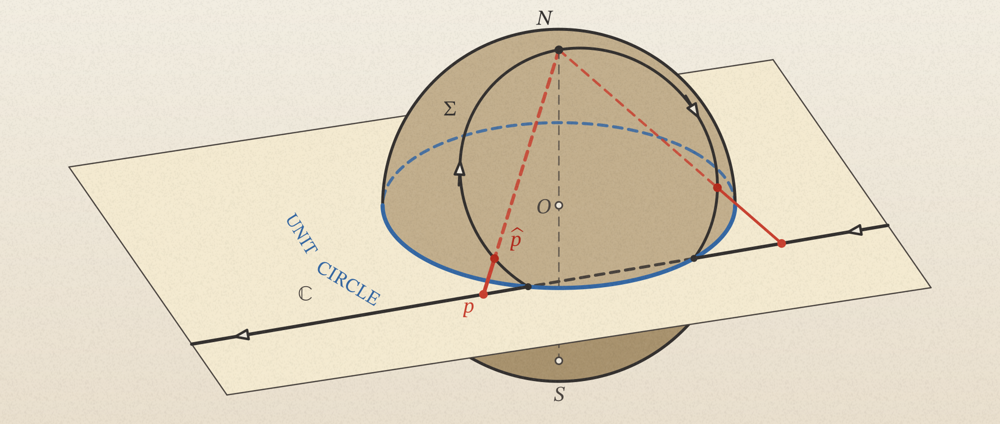

**Claim.** Stereographic projection from the north pole N sends a point p of the plane outside the unit circle to the point p-hat where the ray N->p pierces the northern hemisphere of the unit sphere; the equator is the unit circle itself and its points are fixed — the line through p crosses the unit circle at two points and its image circle passes through the same two points; a straight line through p maps to a circle through N, so p -> infinity drives p-hat -> N.

This is Needham's own construction diagram, Fig [19] (VCA ch. 3, "IV The
Riemann Sphere"), placed at the exact moment the book needs a picture
instead of a definition. Two pages earlier he has argued that z -> 1/z
has no image at 0 and no preimage of 0 unless one point "at infinity" is
added to the plane -- a point defined only by a limiting process, and he
admits plainly that this leaves the reader "none the wiser" about how to
grasp oo as a definite location. Stereographic projection from the north
pole N is the answer: N is one point on an actual sphere, reachable and
drawable the same way the south pole is, not a limit anyone has to take
on faith. The figure has to carry two claims Needham states but does not
prove without a picture: the equator -- the unit circle -- is fixed
pointwise by the projection, and a line through p, followed out toward
infinity, closes up into a genuine circle through N. This is the figure
that turns "the extended plane has one new point" from a verbal patch
into a place the reader can point at.

[svg](complex/demo_sphere_stereographic.svg) · [transparent svg](complex/demo_sphere_stereographic_transparent.svg) · [readback](complex/demo_sphere_stereographic.readback.md)

---

### fig09_exp_series_spiral

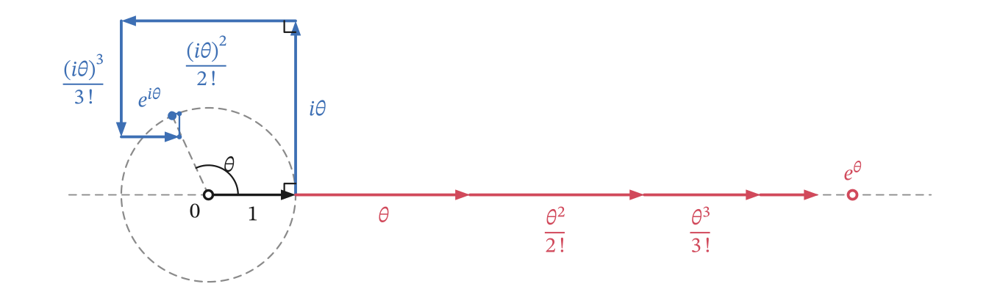

**Claim.** The partial sums of the power series for e^z, evaluated at z = iθ, turn a right angle at every step and spiral into the point e^{iθ} on the unit circle, while the same series at real z = θ moves straight along the real axis toward e^θ.

This is Needham's Fig [9] (VCA ch. 1, "Euler's Formula"), the second of
two independent arguments he gives for e^{i theta} = cos theta +
i sin theta. The first argument is kinematic: a particle at Z(t) = e^{it}
has velocity i*Z(t), its position rotated a right angle, so it must trace
the unit circle at unit speed. The second, drawn here, instead takes the
defining property f' = f as a power series and evaluates it at
z = i*theta: because multiplying by i is a right-angle turn, each term of
the partial sum turns 90 degrees from the last, and the partial sums
spiral rather than march. Needham's point is that ordinary convergence of
the real series for e^theta -- terms all pointing the same way, summing
straight down the real axis -- already guarantees the spiral converges to
some point; what the picture has to additionally make undeniable is that
the point it converges to is the very same e^{i theta} the kinematic
argument produced, two arguments meeting at one point by two different
routes.

[svg](complex/fig09_exp_series_spiral.svg) · [transparent svg](complex/fig09_exp_series_spiral_transparent.svg) · [readback](complex/fig09_exp_series_spiral.readback.md)

---

### inversion_in_circle

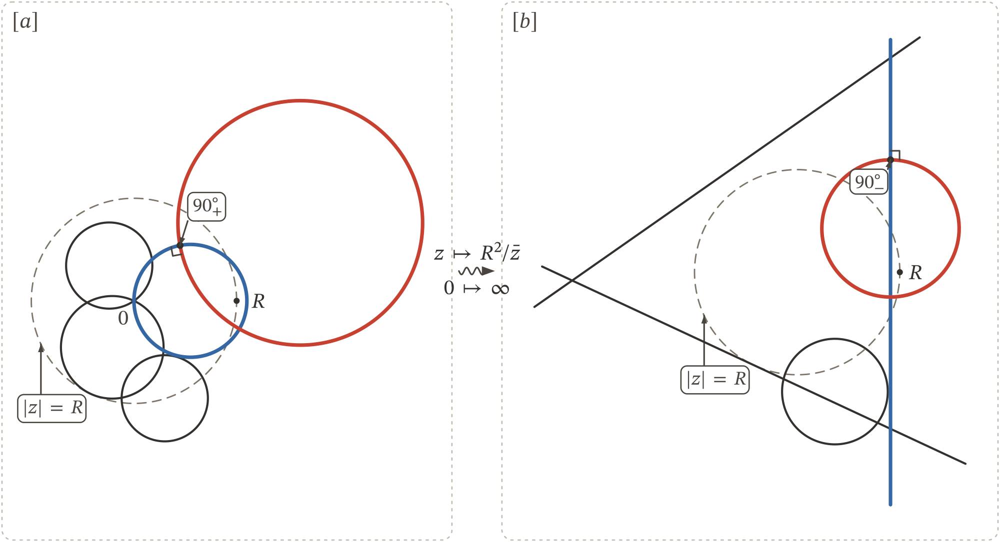

**Claim.** Inversion z -> R^2/z-bar sends circles through the center of inversion to lines, circles that miss the center to circles, fixes the circle |z| = R pointwise, and preserves the angle at which two curves cross in magnitude while reversing its sense -- so an orthogonal pair of circles stays orthogonal, a right angle mapping to a right angle of the opposite hand.

Needham introduces inversion in a circle (Visual Complex Analysis, ch. 3)
as the geometric ancestor of the Mobius transformations: not z -> R^2/z,
which is holomorphic and orientation-preserving, but z -> R^2/z-bar, built
from conjugation -- reflection in the real axis -- composed with the
holomorphic inversion. Conjugation reverses orientation and leaves
Mobius geometry untouched, so the composite is anticonformal: it still
preserves the magnitude of every angle between crossing curves, but flips
its sign. Needham's punchline is that this single map already carries
the whole circle-preserving machinery of Mobius transformations, in its
starkest form: every circle or line (a "circline") maps to a circline,
the circle of inversion |z| = R survives as the fixed locus, and nothing
outside that locus is fixed -- points swap the inside of the circle for
the outside along each ray. The figure asks for the one picture that
makes every clause checkable at once: a family of circles through the
center becoming lines, a family that misses the center staying round, and
a single orthogonal crossing surviving the map with its right angle
intact but its handedness reversed.

[svg](complex/inversion_in_circle.svg) · [transparent svg](complex/inversion_in_circle_transparent.svg) · [readback](complex/inversion_in_circle.readback.md)

---

### mobius_classification

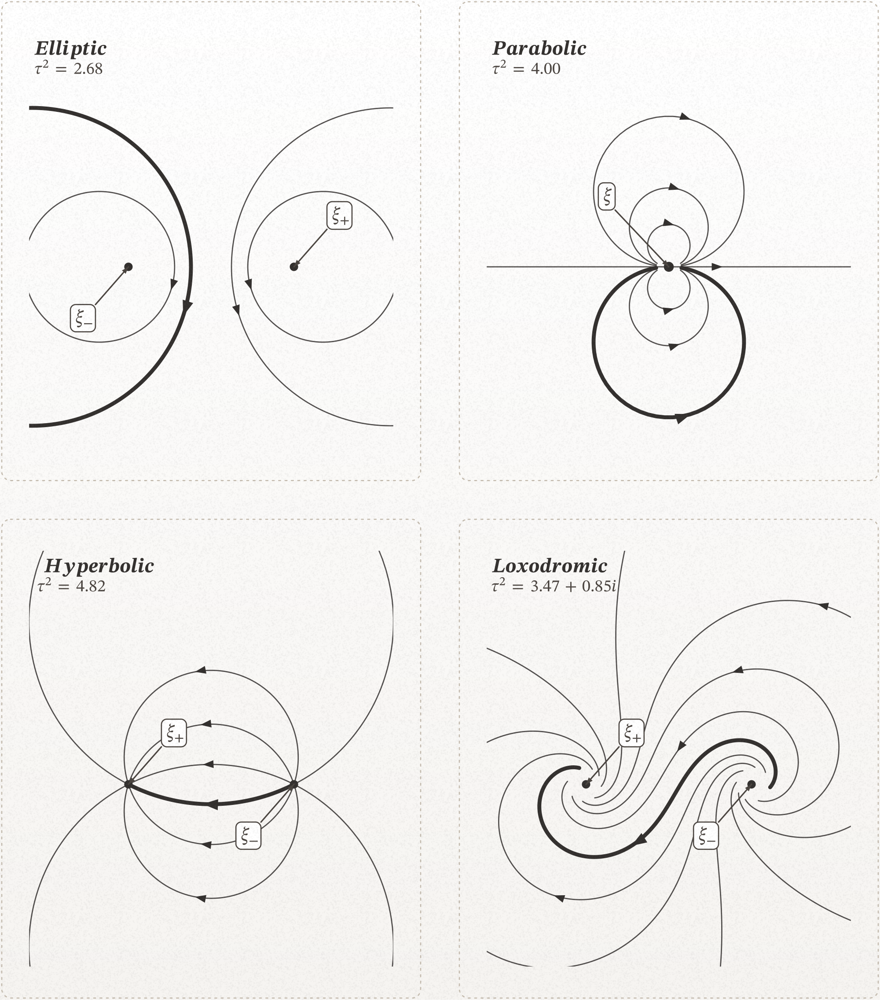

**Claim.** The normalized trace of a Mobius transformation's matrix, tau^2 = tr(M)^2 / det(M), predicts its invariant orbit geometry outright: tau^2 in [0,4) draws closed circles around two centers (elliptic), tau^2 = 4 draws a family tangent at one point (parabolic), real tau^2 > 4 draws arcs flowing source to sink (hyperbolic), and non-real tau^2 draws spirals winding around both poles (loxodromic) -- no case-by-case argument, one number.

Needham's classification of Mobius transformations (Visual Complex
Analysis, ch. 3, "Classification of Mobius Transformations") turns on a
single invariant. Conjugate M to its normal form by sending its fixed
points to 0 and infinity -- F M F^{-1} becomes the elementary map
w -> m w for a complex multiplier m -- and Needham shows the whole
qualitative behaviour of M is read off m alone: |m| = 1 rotates,
m real =/= 1 flows radially, m off the unit circle and off the positive
reals spirals, m = 1 is the one degenerate case with a single fixed
point. What ties this back to M itself, rather than to the coordinates
F happened to choose, is that m is pinned down by tau^2 = tr(M)^2 /
det(M) = m + 1/m + 2 -- the trace-squared-over-determinant is exactly
the quantity invariant under conjugation and rescaling the matrix, so it
depends on M and nothing else. The reader is left, after that one
equation, to reconstruct four qualitatively different pictures from
memory. This figure is the picture the algebra earns but the book leaves
to the reader's imagination: the same four-step construction --
factor the matrix, solve for m from tau^2, draw the orbit family in
normal coordinates, pull it back through F^{-1} -- run once per panel,
so that "trace alone decides the geometry" is something the page shows
rather than the algebra merely implies.

[svg](complex/mobius_classification.svg) · [transparent svg](complex/mobius_classification_transparent.svg) · [readback](complex/mobius_classification.readback.md)

---

### poincare_disc

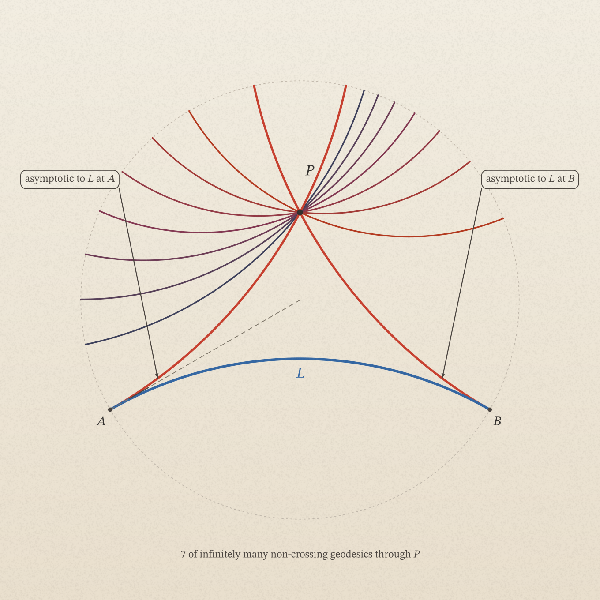

**Claim.** Through a point P off a hyperbolic line L there are infinitely many geodesics that never meet L -- bounded by two limiting parallels asymptotic to L's own ideal endpoints -- where Euclidean geometry permits exactly one.

Chapter 6, "Non-Euclidean Geometry," is Needham's answer to a question
the reader has been trained since childhood not to ask: is Euclid's
fifth postulate actually necessary, or is it an assumption that could
fail? Needham builds the Poincare disc concretely, as the fixed domain
of the Mobius automorphisms of the unit disc, specifically so that
"hyperbolic straight line" has a computable meaning -- a circular arc
meeting the boundary at right angles, a diameter in the degenerate case
-- rather than a purely axiomatic one. The chapter earns the model by
making it answer the parallel postulate directly: given a line L and a
point P off it, Euclid says exactly one line through P misses L. In the
disc, Needham shows, that count is not one and not zero -- it is a
continuum, bounded by two special geodesics that share an ideal
endpoint with L, asymptotic to it at the boundary circle, with every
geodesic strictly between them missing L entirely.

This figure draws that count rather than asserting it: L, an external
point P, its two limiting parallels, and a finite sample from the
infinite non-crossing family between them, so "infinitely many" is a
fan the reader can see opening rather than a phrase to take on faith.

[svg](complex/poincare_disc.svg) · [transparent svg](complex/poincare_disc_transparent.svg) · [readback](complex/poincare_disc.readback.md)

---

### vca_fig12_flow_grid

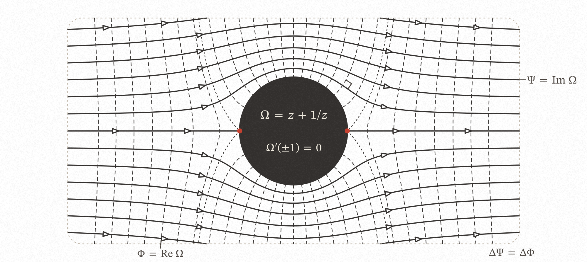

**Claim.** The level curves of Psi = Im Omega and Phi = Re Omega for Omega = z + 1/z form an orthogonal grid of near-squares that flows around the disc and breaks down only at the stagnation points +-1, where the map ceases to be conformal.

This is Needham's Fig [12] itself (VCA, "Vector Fields and Complex
Integration," section "The Complex Potential"), the flow he calls
"totally irrotational": Gamma = 0, no vortex term, the one flow round the
disc that a uniform stream determines uniquely and without ambiguity.
Needham arrives at it by an argument built entirely from k-cells: once
Phi and Psi are both harmonic and mutually orthogonal, choosing equal
increments k for both families divides the plane into cells whose sides
he proves equal in the limit -- "the k-cells are squares" -- and packages
that fact as Omega' = H, the complex potential's derivative is the
velocity field. This figure runs that theorem on the one example Needham
actually draws: the streamline and equipotential ladders for
Omega = z + 1/z, spaced by the same dk, so the near-square grid is
something the reader can check cell by cell, and the two places the
whole scheme is allowed to fail -- the stagnation points z = +-1, where
Omega' vanishes and the squares degenerate into two branches crossing at
45 degrees -- are shown actually breaking, not just marked.

[svg](complex/vca_fig12_flow_grid.svg) · [transparent svg](complex/vca_fig12_flow_grid_transparent.svg) · [readback](complex/vca_fig12_flow_grid.readback.md)

---

### vca_fig14_volcanoes

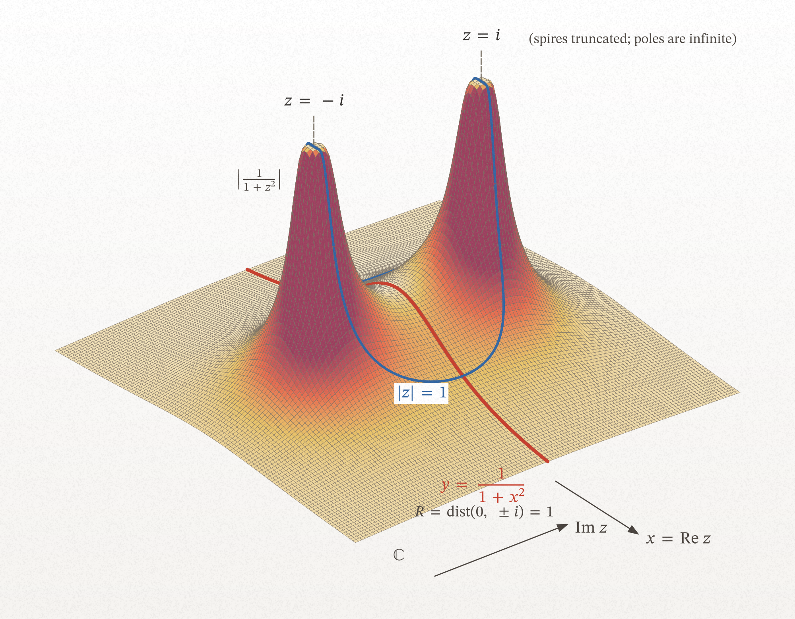

**Claim.** The graph of 1/(1+x^2) is the tranquil real-axis slice of the modular surface of 1/(1+z^2), which erupts to infinity at the poles z = +-i; the Taylor series of the real function at 0 therefore converges only up to distance 1 — the distance to the invisible complex poles.

Needham sets this figure up (VCA ch. 2, "Power Series," section "The
Mystery of Real Power Series," p. 66) as the resolution to a puzzle he
poses deliberately. G(x) = 1/(1-x^2) and H(x) = 1/(1+x^2) have the
identical radius of convergence, 1, but only G's breakdown makes sense on
the real line -- G actually blows up at x = +-1, while H stays smooth and
bounded everywhere real x can reach. Something invisible from the real
axis alone must be limiting H's series, and Needham's answer is to stop
looking at the real axis alone: h(z) = 1/(1+z^2) has honest poles at
z = +-i, and the radius of convergence of any Taylor series is exactly
the distance to the nearest one. Fig [14] is the picture that makes the
poles visible as poles -- not a formula, an eruption -- by plotting
|h(z)| as a surface over the whole plane: the tame real-axis graph the
reader already trusts is sitting right there as the front slice, and the
two spires at +-i are the very singularities that were, all along, one
unit away.

[svg](complex/vca_fig14_volcanoes.svg) · [transparent svg](complex/vca_fig14_volcanoes_transparent.svg) · [readback](complex/vca_fig14_volcanoes.readback.md)

---

### vca_fig30_elliptic_checkerboard

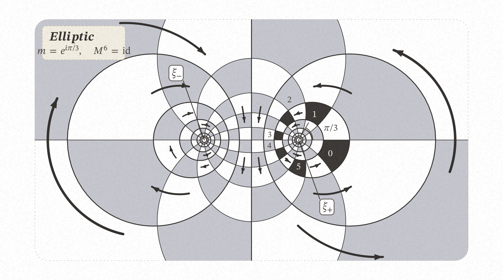

**Claim.** An elliptic Mobius transformation rotates the whole plane along the invariant Apollonian circles about its two fixed points, each application advancing every cell of the bipolar net by the fixed multiplier angle pi/3 -- so the black orbit of one cell closes after six steps: M^6 = id.

Chapter 3, "Mobius Transformations and Inversion," reaches its
classification theorem by conjugating an arbitrary Mobius map M to its
normal form: send its two fixed points to 0 and infinity, and M becomes
the elementary map w -> m w for a complex multiplier m. Needham's
qualitative taxonomy -- elliptic when |m| = 1, hyperbolic when m is
real, loxodromic otherwise -- turns on nothing but that one number, and
his own figure at this point in the book works the elliptic case in
full: fixed points at +-1, a bipolar coordinate net built by pulling a
log-polar grid back through the conjugating map, and one cell of that
net followed around its orbit under repeated application of M. Because
m = e^{i pi/3} here, the orbit closes after exactly six steps -- M^6 is
the identity -- and the whole net rotates rigidly along the invariant
(Apollonian) circles threading the two poles, the picture Needham uses
to make "elliptic" mean something more concrete than "|m| = 1."

This figure is a direct recreation of that page: the same bipolar net,
the same six-cell orbit rendered as a checkerboard, and the pi/3 advance
angle drawn at the fixed point it rotates about, so M^6 = id is a count
of drawn cells rather than a fact taken on the multiplier's word alone.

[svg](complex/vca_fig30_elliptic_checkerboard.svg) · [transparent svg](complex/vca_fig30_elliptic_checkerboard_transparent.svg) · [readback](complex/vca_fig30_elliptic_checkerboard.readback.md)

---

### vca_fig4_zn_polar_grid

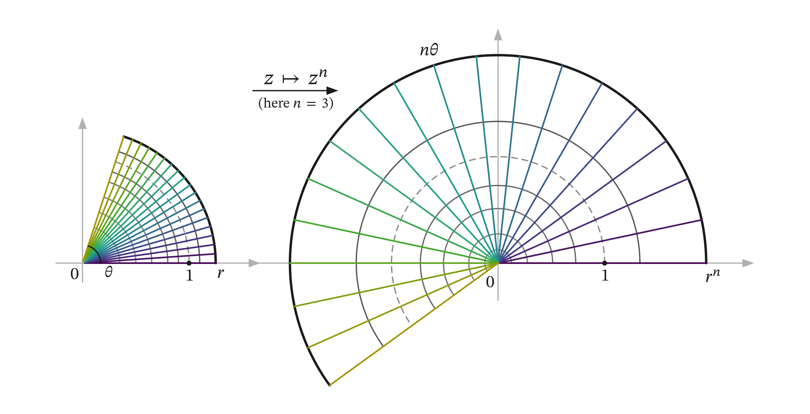

**Claim.** The mapping z -> z^3 sends each ray at angle theta to the ray at angle 3*theta and each circular arc of radius r to the arc of radius r^3, so a polar-grid sector opens out into a fan three times as wide while every grid intersection stays a right angle.

Chapter 2, "Complex Functions as Transformations," section II.1
("Positive Integer Powers"), is where Needham first cashes in the
book's central habit — picture a function as a map that carries the
whole plane somewhere, not as a formula evaluated pointwise. Before he
has named the derivative or conformality, he needs the reader to
already trust two structural facts about z -> z^n: radial lines survive
as radial lines, only rotated by a multiple of their original angle,
and circles survive as circles, only rescaled in radius. Both facts
follow at once from writing z in polar form, z = r e^{i theta}, so that
z^n = r^n e^{in theta} — but stated that way they read as an algebraic
identity, not as a claim about shape. Needham's own figure at this
point is exactly this: the polar grid under z -> z^n, because a grid is
the cheapest object whose distortion makes "angles multiply, radii
don't" into something the eye checks.

This figure reproduces that grid with one modern addition: hue tags
each ray by its angle, so a ray can be tracked to its image by color
rather than by re-deriving n*theta, and the right angle at every grid
crossing survives the map — conformality, a fact Needham has not yet
named, already sitting in the picture.

[svg](complex/vca_fig4_zn_polar_grid.svg) · [transparent svg](complex/vca_fig4_zn_polar_grid_transparent.svg) · [readback](complex/vca_fig4_zn_polar_grid.readback.md)

---

### vca_fig9_cassinian

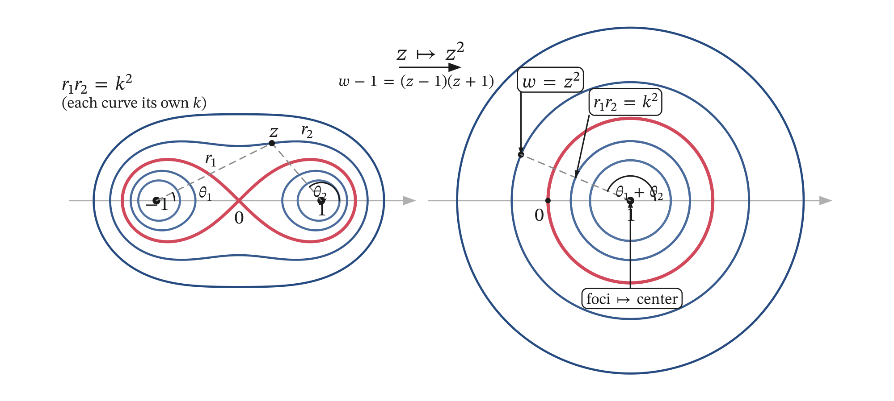

**Claim.** The Cassinian curves |z-1||z+1| = k^2 with foci +-1 are exactly the preimages under w = z^2 of the concentric circles |w-1| = k^2, with the k=1 lemniscate mapping to the circle through the origin.

Still in Chapter 2's "Polynomials" section (II.3, "Cassinian Curves"),
Needham tells the history before the math: Newton's confocal ellipses
(constant SUM of distances to two foci) against Cassini's rival family
(constant PRODUCT of distances), proposed as a competing model of
planetary orbits and wrong for that purpose, but geometrically
interesting on its own terms — as k grows, the two-egg curve merges
into a figure eight (Bernoulli's lemniscate), then rounds into an
ellipse, and finally a circle. Needham's payoff is that this family is
not an ad hoc zoo: writing the quadratic with roots at the two foci,
Q(z) = (z-a1)(z-a2), the defining relation |z-a1||z-a2| = k^2 is exactly
|Q(z)| = k^2, so every Cassinian curve is the PREIMAGE of an
origin-centered circle |w| = k^2 under w = Q(z). The lemniscate, the
curve everyone remembers, is just the one member of the family whose
image circle happens to pass through the origin.

This figure draws both sides of that correspondence — the Cassinian
family on the left, the concentric circles it maps to on the right, one
color per level k held across the arrow — so the "family of curves" is
seen to be a single circle family in disguise, not a coincidence of
shape.

[svg](complex/vca_fig9_cassinian.svg) · [transparent svg](complex/vca_fig9_cassinian_transparent.svg) · [readback](complex/vca_fig9_cassinian.readback.md)

---

### winding_number

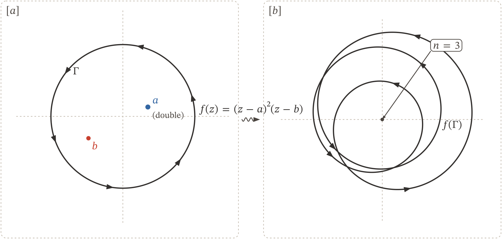

**Claim.** As z traces Gamma once counterclockwise, f(z) = (z-a)^2 (z-b) traces a closed curve that winds around w = 0 exactly three times — twice for the double zero at a, once for the simple zero at b — because the winding number of f(Gamma) equals the enclosed zero count with multiplicity.

Chapter 7, "Winding Numbers and Topology," builds toward the Argument
Principle by first making the winding number itself a physical,
countable thing — how many times a loop wraps the origin, read off a
picture rather than computed as an integral. Needham then asks the
question the topology exists to answer: if f is analytic and Gamma is a
loop that avoids every zero and pole of f, how many times does the
image curve f(Gamma) wind around w = 0? His answer, argued directly
from arg f(z) = sum_i arg(z - z_i) - sum_j arg(z - p_j), is that only
the zeros and poles Gamma actually encloses contribute net turning as z
completes its loop — everything outside contributes nothing, because
its vantage point is never circled. A zero of multiplicity two pulls
twice the turning of a simple zero, for the same reason a rope wound
twice around a post takes two full turns to unwind.

This figure makes that bookkeeping visible: a double zero and a simple
zero sit inside a circular Gamma, and the reader watches f(Gamma) coil
around the origin three times for one circuit of Gamma — two turns
traceable to the double root, one to the simple one — so multiplicity
is read off the image curve's own winding, not asserted from the
formula.

[svg](complex/winding_number.svg) · [transparent svg](complex/winding_number_transparent.svg) · [readback](complex/winding_number.readback.md)

---

## signals

*Sampling, spectra, and the geometry of transfer functions.*

### dft_matrix_basis

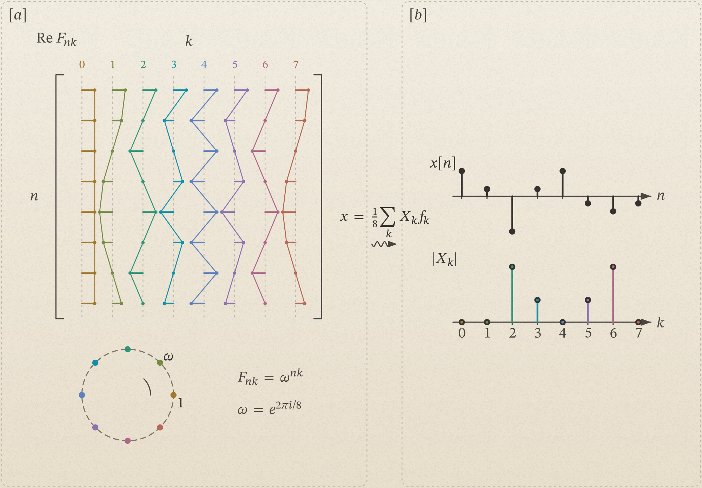

**Claim.** The 8-point DFT matrix is a basis gallery: column k, drawn as a mini waveform, is the complex exponential of frequency k sampled at n = 0..7 and generated by the k-th root of unity (same hue); the signal x[n] = cos(2 pi 2n/8) + 0.4 sin(2 pi 3n/8) is the hue-matched weighted sum of exactly the columns its spectrum |X_k| lights up, and F is unitary up to 1/8.

Strang's reading of the DFT matrix, made literal: F is not a formula
for computing a spectrum, it is a change of basis, and its columns are
the basis vectors. Column k is the complex exponential of frequency k,
sampled at n = 0..N-1 -- a discrete sinusoid generated by raising the
N-th root of unity omega to the power k, one value per row. A signal
x[n] is some combination of these N columns, and the DFT is exactly the
bookkeeping that finds the combination: X_k is the coefficient column k
must carry so that (1/N) sum_k X_k f_k reconstructs x. Read that way,
|X_k| large means "x leans heavily on column k's waveform" and |X_k| = 0
means "column k contributes nothing" -- the spectrum is a set of weights
on a fixed gallery of waveforms, not a separate object computed from x
by a different kind of arithmetic. Unitarity of F/sqrt(N) is what makes
those weights well-defined and recoverable at all.

[svg](signals/dft_matrix_basis.svg) · [transparent svg](signals/dft_matrix_basis_transparent.svg) · [readback](signals/dft_matrix_basis.readback.md)

---

### polezero_response

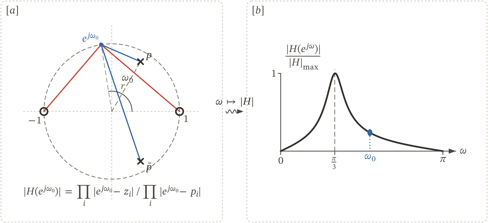

**Claim.** The magnitude response of H(z) is read geometrically off the z-plane: at each omega, |H(e^{j omega})| is the product of the distances from e^{j omega} to the zeros divided by the product of the distances to the poles — so the conjugate pole pair at radius 0.85 and angle pi/3 carves a resonance peak at omega = pi/3, and the zeros at z = +-1 pin nulls at omega = 0 and pi.

Julius Smith's way of reading a transfer function: don't compute
|H(e^{j omega})| from algebra, read it off the z-plane geometrically.
Every zero and pole is a fixed point in the plane; e^{j omega} is a
point walking the unit circle as omega sweeps from 0 to pi. At any
instant the magnitude response is the product of the distances from
that walking point to each zero, divided by the product of distances to
each pole -- a ratio of chord lengths, recomputed fresh at every omega,
and the response curve is just that ratio plotted against the walk's
angle. The shape follows without any transform: a pole close to the
unit circle means some angle where the chord to it gets very short, so
the denominator collapses and the response peaks near that pole's
angle; a zero sitting ON the circle means the chord to it hits zero
exactly there, so the response nulls at that zero's angle exactly.
Nothing about the curve is a separate fact from the picture -- it is
the picture, read as e^{j omega} completes its walk.

[svg](signals/polezero_response.svg) · [transparent svg](signals/polezero_response_transparent.svg) · [readback](signals/polezero_response.readback.md)

---

### sampling_aliasing

**Claim.** Sampling at rate omega_s convolves a spectrum with an impulse comb of spacing omega_s, replicating the triangle at every multiple of omega_s; the replicas stay separated exactly when omega_s > 2*omega_m, and when omega_s < 2*omega_m adjacent replicas overlap in a band of width 2*omega_m - omega_s where the spectrum is unrecoverable.

This is Oppenheim & Schafer's picture for why sampling has a rate at
all: sampling a continuous signal at rate omega_s does not distort its
spectrum, it replicates it -- convolving with an impulse comb places a
full copy of X(j omega) at every integer multiple of omega_s. Nothing
about a single replica changes; what changes is whether replicas
collide. The Nyquist condition omega_s > 2 omega_m is not an assumption
about the signal imposed for its own sake, it is the exact statement
that consecutive copies of a triangle of half-width omega_m stay clear
of each other. Read the frames in sequence: at omega_s > 2 omega_m the
gap between copies is a real gap, and an ideal lowpass filter recovers
the base replica intact. Push omega_s below 2 omega_m and the gap goes
negative -- the replicas overlap in a band of width 2 omega_m - omega_s,
and inside that band the sampled spectrum is the SUM of two triangles
that no filter can separate back into one, because the aliased
frequency components are now indistinguishable from ones that were
never there. That band, not an inequality, is what aliasing is.

[svg](signals/sampling_aliasing.svg) · [transparent svg](signals/sampling_aliasing_transparent.svg) · [readback](signals/sampling_aliasing.readback.md)

---

## linalg

*Matrices as geometry: the four readings, low rank, conditioning.*

### conditioning_ellipse

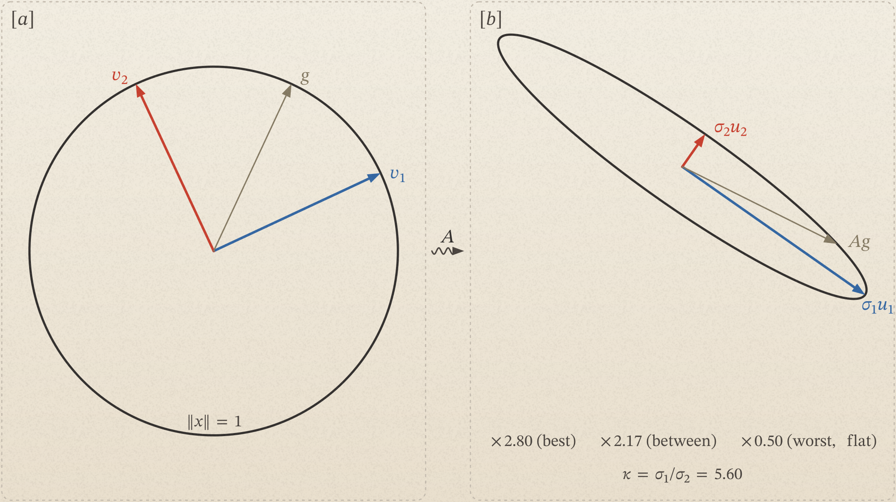

**Claim.** A maps the unit circle to an ellipse with semi-axes sigma_1 >= sigma_2 along the left singular vectors u_1, u_2: a unit-size input perturbation is stretched by a factor that ranges over [sigma_2, sigma_1] depending only on its direction, and the ratio between the best-conditioned direction (v_1, stretched by sigma_1) and the worst -- the flat direction v_2, stretched by only sigma_2 -- is exactly kappa = sigma_1 / sigma_2, attained, not merely bounded.

This is the standard picture behind Trefethen & Bau's treatment of
conditioning (Lecture 12): every linear map's relative sensitivity to
perturbation is governed by the SVD, and the geometry makes the bound
visible instead of algebraic. Feed A the unit circle and read off the
image: it is an ellipse, its semi-axes are the singular values, its axis
directions are the left singular vectors. That picture already contains
the whole conditioning story. A unit perturbation applied along v_1 comes
out as sigma_1 u_1 -- the long axis, the direction A stretches most, the
best-conditioned direction because the map's action there is easiest to
undo. The same-size perturbation applied along v_2 comes out as only
sigma_2 u_2 -- the flat direction, where A compresses instead of
amplifying, so recovering that perturbation from the output means
dividing by the smallest possible gain and any noise in the output gets
amplified the most on the way back. Every other direction lands strictly
between these two extremes (a Rayleigh-quotient fact, not a hope), so the
ratio of worst to best -- kappa = sigma_1/sigma_2 -- is not a loose
worst-case estimate: it is exactly attained by this one pair of rays, and
no direction does worse. The figure draws both the range and its two
attaining endpoints, so the bound and its tightness are the same claim.

[svg](linalg/conditioning_ellipse.svg) · [transparent svg](linalg/conditioning_ellipse_transparent.svg) · [readback](linalg/conditioning_ellipse.readback.md)

---

### matrix_four_views

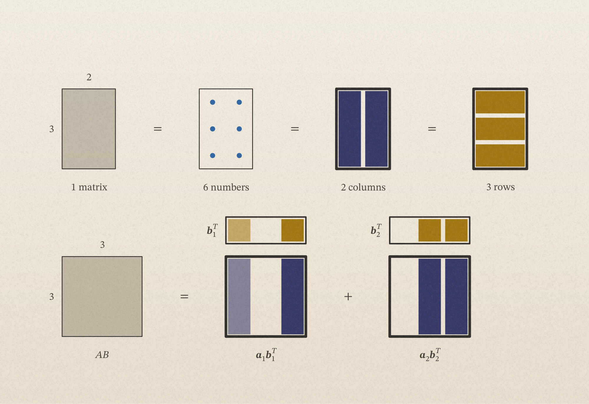

**Claim.** A matrix has four readings — one whole, mn entries, n columns, m rows — and choosing the column-and-row reading is what turns the product AB into a sum of rank-1 matrices, one per column of A paired with the matching row of B.

Strang's point is that a matrix product is not one operation with one
correct way to compute it -- it has (at least) four readings, and each
reading makes a different fact about the product obvious. Read AB
entry by entry (row of A dot column of B) and you get a number at a
time, with no structure. Read B's columns as things A acts on, and AB's
columns are combinations of A's columns. Read A's rows as things acting
on B, and AB's rows are combinations of B's rows. But read A by its
columns AND B by its rows together, pairing column k of A with row k of
B, and the product becomes a SUM of rank-1 matrices, one per pairing --
a fact invisible from the entry-by-entry view and not derivable from
either one-sided reading alone. Which reading to reach for is not a
matter of taste: the column-times-row reading is the one that explains
why low-rank matrices decompose the way they do, why outer-product
updates work, and why a matrix product can be built up term by term
instead of computed all at once.

[svg](linalg/matrix_four_views.svg) · [transparent svg](linalg/matrix_four_views_transparent.svg) · [readback](linalg/matrix_four_views.readback.md)

---

### svd_low_rank

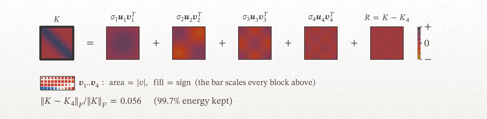

**Claim.** A smooth Gaussian kernel matrix is nearly rank 4: drawn exactly as K = sum_{k<=4} sigma_k u_k v_k^T + R, its four rank-1 modes are signed and oscillate at rising frequency like a Fourier basis, and the residual R is visibly flat at the same color scale as K — 5.6% relative Frobenius error, 99.7% of the energy kept.

The SVD is not a factorization to be trusted on faith, it is a sum:
A = sum_k sigma_k u_k v_k^T, one rank-1 outer product per singular
value, ordered so sigma_1 >= sigma_2 >= .... Because the terms are
ordered and the singular values typically decay, truncating that sum
after r terms is not an arbitrary compression -- Eckart-Young says it
is the BEST rank-r approximation to A in Frobenius (and operator) norm,
better than any other rank-r matrix obtained any other way. The question
a truncation raises is always the same one: how much of A is really
carried by the first few modes, and how much is left in the tail. A
smooth kernel matrix answers that question favorably -- its singular
values fall off fast enough that a handful of outer products already
account for nearly all the energy -- but the claim is only honest if the
discarded remainder is shown next to the kept terms at the same scale,
not asserted from the decay rate alone.

[svg](linalg/svd_low_rank.svg) · [transparent svg](linalg/svd_low_rank_transparent.svg) · [readback](linalg/svd_low_rank.readback.md)

---

## dynamics

*Flows, bifurcations, and stochastic trajectories.*

### demo_basin_wash

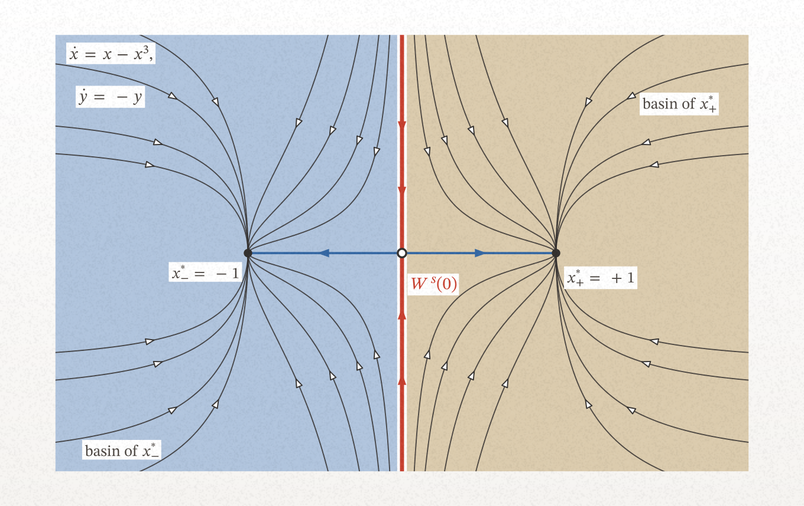

**Claim.** One curve of measure zero — the saddle's stable manifold, here the y-axis — splits the whole plane into the two basins of the double-well gradient flow; every trajectory off it ends at the sink of its side.

A bistable flow is only half specified by its sinks -- the other half is
which initial conditions end up at which sink, and that partition is drawn
by the stable manifold of whatever saddle sits between them. For the
gradient flow of a double-well potential, the saddle at the origin has a
one-dimensional stable manifold that is a single curve, yet that curve of
measure zero is doing all the classifying work: cross it and the long-run
fate of the trajectory flips discontinuously, even though the vector field
itself varies smoothly. This is the argument a reader needs before basins
of attraction stop being a vague picture of "regions that flow somewhere"
and become the specific claim that the boundary between two basins is
exactly the saddle's stable manifold, nothing more and nothing less --
the same fact that underlies watershed boundaries, separatrices in
predator-prey models, and the basin geometry of any multistable system.

[svg](dynamics/demo_basin_wash.svg) · [transparent svg](dynamics/demo_basin_wash_transparent.svg) · [readback](dynamics/demo_basin_wash.readback.md)

---

### demo_ou_ensemble_field

**Claim.** An OU ensemble's marginal p_t(x) contracts onto the stationary law N(0, sigma^2/2theta) while every individual sample path keeps fluctuating at full stationary amplitude — the density converges, the paths do not.

The Ornstein-Uhlenbeck process is the standard model for a fluctuation that
relaxes toward a mean but never stops fluctuating, and the point that trips
up a first reading is the difference between what the ENSEMBLE does and
what any ONE realization does. The mean of the ensemble decays exponentially
toward zero and the variance saturates at a finite stationary value in
finite time -- both are properties of the marginal distribution p_t(x), and
both converge. No individual sample path converges to anything: at every
later time it is still executing a mean-reverting random walk with the same
stationary amplitude it always had. A reader who has only seen the moment
equations dm/dt = -theta*m and dv/dt = sigma^2 - 2*theta*v can mistake
"the distribution has settled down" for "the process has settled down" --
they are not the same statement, and this figure is the demonstration that
the density can freeze while every path underneath it keeps moving.

[svg](dynamics/demo_ou_ensemble_field.svg) · [transparent svg](dynamics/demo_ou_ensemble_field_transparent.svg) · [readback](dynamics/demo_ou_ensemble_field.readback.md)

---

### diffusion_ode_vs_sde

**Claim.** Starting from the same draws of pure noise, the jittery reverse-time SDE paths and the smooth deterministic probability-flow ODE paths of a diffusion model transport the standard-normal prior into the same two-mode data distribution, because both integrate the same score field and share the same marginals at every intermediate time.

Once a diffusion model's score function is trained, there are two distinct
ways to turn noise into data, and understanding why they agree is what
separates knowing the formula from understanding the object. The reverse
SDE integrates a stochastic differential equation driven by the same score
field plus injected noise, producing a different, jittery sample path every
time it is run from the same starting point. The probability-flow ODE
drops the injected noise and keeps only the deterministic drift, producing
a single smooth, invertible trajectory. The two are not two competing
samplers where one is an approximation of the other -- they are two
different stochastic processes that happen to share every one-time
marginal distribution p_t(x), by construction of the score field they both
integrate. A reader needs to see this to understand why swapping SDE
sampling for ODE sampling (for speed, or for the ODE's exact likelihood via
the instantaneous change-of-variables formula) changes nothing about what
distribution comes out, only how the individual sample path gets there.

[svg](dynamics/diffusion_ode_vs_sde.svg) · [transparent svg](dynamics/diffusion_ode_vs_sde_transparent.svg) · [readback](dynamics/diffusion_ode_vs_sde.readback.md)

---

### saddle_node_behavior_map

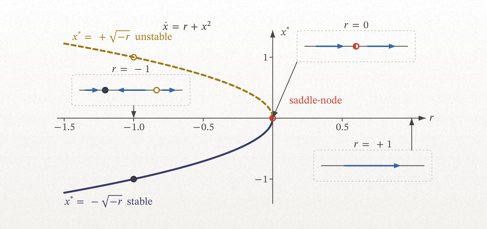

**Claim.** The bifurcation diagram of xdot = r + x^2 is a map of behaviors: every vertical slice IS a one-dimensional phase line, shown literally by three word-scale phase-line thumbnails pinned to their r on the axis — two fixed points for r < 0 whose dots wear the hues of the stable (solid) and unstable (dashed) branches they live on, one half-stable point at the saddle-node r = 0 where the branches merge, and bare rightward flow for r > 0 where the diagram is empty because nothing exists there.

A bifurcation diagram is usually introduced as a summary: plot the fixed points
against the parameter and read off where they appear and vanish. That framing
quietly makes the diagram a plot OF a system, when the more useful reading is
that it is an atlas of systems -- every vertical slice of the (r, x*) plane is
itself a complete one-dimensional dynamical system, and the branch curves record
where each of those systems keeps its fixed points. Strogatz's own presentation
sets three phase portraits beside the diagram and leaves the correspondence to
the reader.

What that layout cannot make perceptual is that the systems live INSIDE the
parameter plane. This figure embeds the phase lines at their own r, pinned to
the axis by leaders, so "slice = system" stops being a caption and becomes a
spatial fact: each thumbnail sits over the very r it depicts, its dots wear the
hues of the branches they live on, and the leader IS the slice. The r > 0
thumbnail carries bare rightward flow with no dots at all -- the region where
the diagram is empty is exactly the region where nothing exists, which is the
one part of the atlas reading a summary plot renders invisible.

[svg](dynamics/saddle_node_behavior_map.svg) · [transparent svg](dynamics/saddle_node_behavior_map_transparent.svg) · [readback](dynamics/saddle_node_behavior_map.readback.md)

---

### strogatz_saddle_node

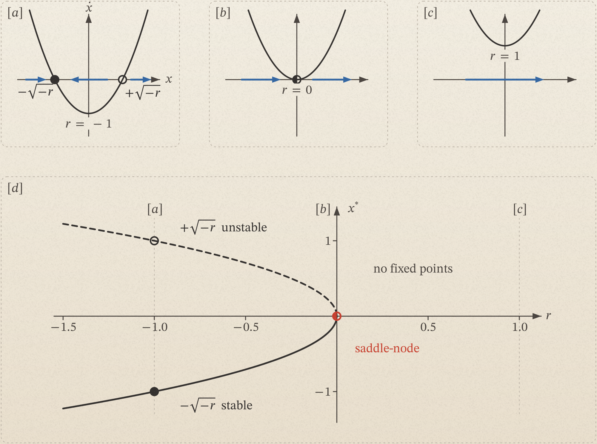

**Claim.** In xdot = r + x^2 the two fixed points x* = -sqrt(-r) (stable) and x* = +sqrt(-r) (unstable) are the two crossings of a parabola that rides upward with r: as r -> 0 from below they approach, at r = 0 they merge into a single half-stable point, and for r > 0 the parabola has cleared the axis, so no fixed point exists and the flow is rightward everywhere.

Strogatz's treatment of one-dimensional flows builds toward the saddle-node
bifurcation as the prototype for how equilibria are born and destroyed: not
by a discontinuous jump but by two fixed points -- one stable, one unstable
-- sliding toward each other as a parameter varies, merging into a single
half-stable point at the critical value, and then vanishing entirely. The
question a reader needs answered is why the merger is forced rather than
coincidental: because the fixed points are exactly the zeros of a parabola
that rides upward with the parameter, a real curve has to lose its two
crossings by first fusing them into one tangency, not by teleporting them
away. This figure is the argument for that mechanism, not an illustration
of the endpoint: the parabola crossing the axis is the geometric object
underneath the phrase "collision and annihilation of fixed points" that
every subsequent bifurcation (transcritical, pitchfork, Hopf) builds on.

[svg](dynamics/strogatz_saddle_node.svg) · [transparent svg](dynamics/strogatz_saddle_node_transparent.svg) · [readback](dynamics/strogatz_saddle_node.readback.md)

---

## optim

*What actually governs convergence.*

### illconditioned_descent

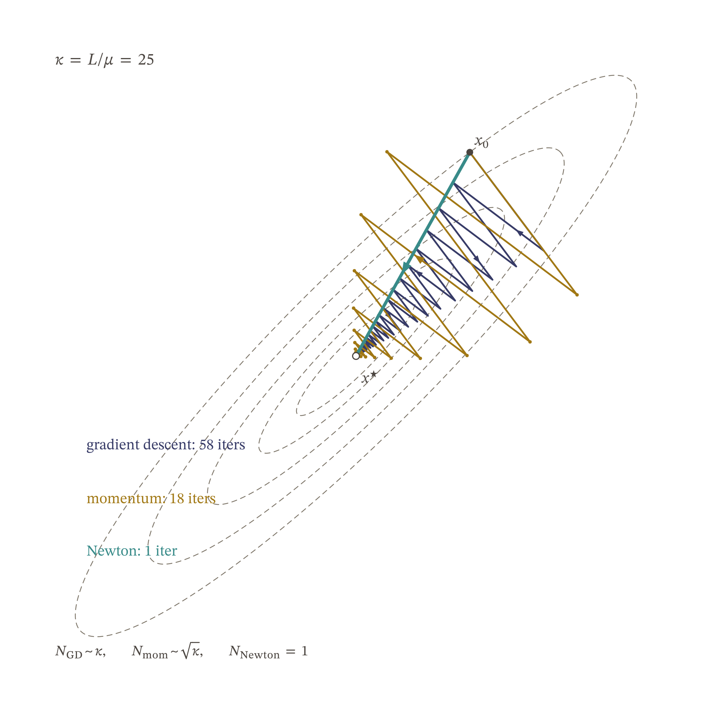

**Claim.** Gradient descent's iteration count is governed by the Hessian's condition number kappa, not the step size: on the same ill-conditioned quadratic, plain steepest descent needs ~kappa iterations to zig-zag to tolerance, heavy-ball momentum cuts that to ~sqrt(kappa) by damping the oscillation rather than shrinking the step, and Newton's method reaches the optimum in a single step because it rescales by the Hessian and so never sees kappa at all.

The optimization textbook's standard cautionary result (Nocedal & Wright;
Boyd & Vandenberghe) is that gradient descent's convergence rate on a
quadratic is set by the Hessian's condition number kappa = L/mu, not by how
carefully the step size is tuned. With the best constant step, steepest
descent still needs on the order of kappa iterations to reach a fixed
relative tolerance, because the same step that is barely stable along the
steep direction is absurdly conservative along the shallow one -- the
method is forced to zig-zag across the narrow valley instead of walking
down it. A reader who has only seen the bound N ~ O(kappa) in symbols needs
to see the zig-zag itself, and needs to see that the two standard remedies
attack kappa rather than the step: heavy-ball momentum turns the recursion
into a damped oscillator whose rate depends on sqrt(kappa) instead of
kappa, at the cost of legitimate overshoot, while Newton's method rescales
by the Hessian itself and so never sees kappa at all, converging in one
step regardless of how ill-conditioned the problem is.

[svg](optim/illconditioned_descent.svg) · [transparent svg](optim/illconditioned_descent_transparent.svg) · [readback](optim/illconditioned_descent.readback.md)

---

## probability

*Densities under maps, and where the mass really lives.*

### concentration_of_measure

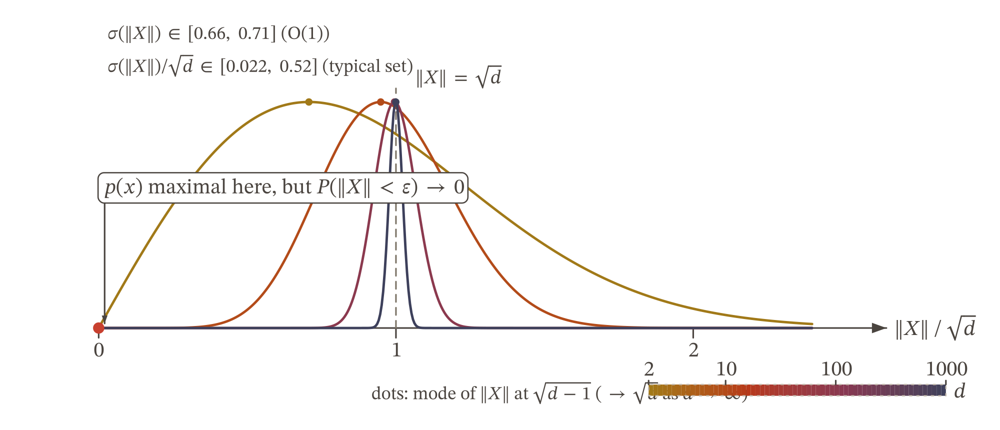

**Claim.** For X ~ N(0, I_d), the joint density p(x) is maximized at the origin, but the density of ||X|| vanishes there and instead concentrates tightly around sqrt(d): the shell's absolute width stays O(1) as d grows while its width relative to sqrt(d) shrinks like 1/sqrt(d), so the mode of p and the location of a typical sample pull apart.

High-dimensional probability keeps producing facts that contradict
low-dimensional intuition, and Vershynin's treatment of Gaussian
concentration is the cleanest example: the density of X ~ N(0, I_d) is
strictly maximized at the origin, yet almost no sample from that same
distribution ever lands near the origin. The resolution is that probability
mass is density times volume, and in high dimensions the volume of a thin
shell at radius r grows like r^{d-1} -- a factor that vanishes at r = 0 and
overwhelms the density's own peak everywhere else, so the mass concentrates
on a shell near r = sqrt(d) while the mode of the density sits in a region
the mass essentially never visits. A reader needs this picture, not just
the chi-distribution formula, to internalize why "most probable point" and
"typical sample" stop being synonyms once the dimension is large -- and the
same mechanism, density times volume, is exactly what makes a language
model's highest-probability output different from the sequence a sampler
actually draws.

[svg](probability/concentration_of_measure.svg) · [transparent svg](probability/concentration_of_measure_transparent.svg) · [readback](probability/concentration_of_measure.readback.md)

---

### prml_polyfit_multiples

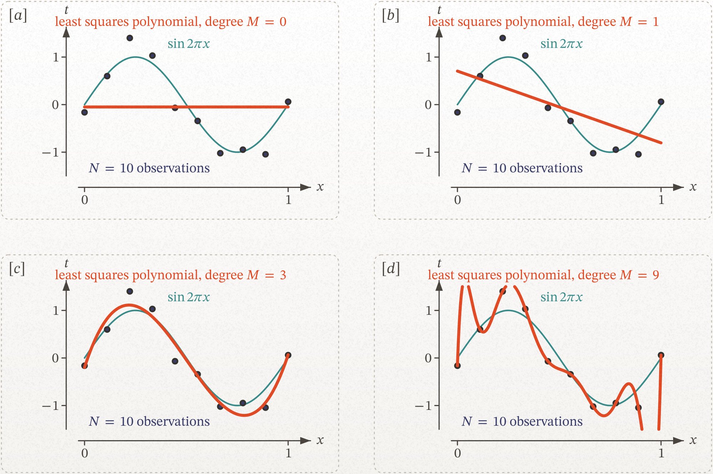

**Claim.** Least-squares polynomial fits of one 10-point sample of sin(2*pi*x) + noise go from underfitting to interpolating as the degree M rises: M = 0 and M = 1 cannot reach the signal, M = 3 recovers it, and M = 9 — one free coefficient per data point — passes exactly through every observation and swings off the frame between them, fitting the noise rather than the function.

Bishop opens Pattern Recognition and Machine Learning with polynomial curve
fitting because it is the smallest setting where the central tension of the
whole subject is already fully present: a model class indexed by one integer,
a fixed finite sample, and a true function you are allowed to know only because
this is a textbook. The sentence the section has to deliver is that increasing
capacity fits the sample better and the signal worse. Stated as prose it is
believed and not seen, and what it hides is precisely WHERE the extra freedom
goes.

The inference is a comparison across four fits of ONE sample, and comparison
across four things is what prose cannot co-locate -- the reader is asked to hold
three earlier curves in memory while reading about the fourth. Drawn as small
multiples over the same ten points, with every non-M quantity rendered
identically, the conclusion becomes a visual feature rather than a claim: the
fitted curve peels away from the true sine and starts chasing individual dots.
At M = 9, one free coefficient per observation, it passes exactly through every
one of them and swings off the frame in between. Nothing about that is
surprising once you count parameters; the point is that it is now something you
look at instead of something you take on faith.

[svg](probability/prml_polyfit_multiples.svg) · [transparent svg](probability/prml_polyfit_multiples_transparent.svg) · [readback](probability/prml_polyfit_multiples.readback.md)

---

### pushforward_density

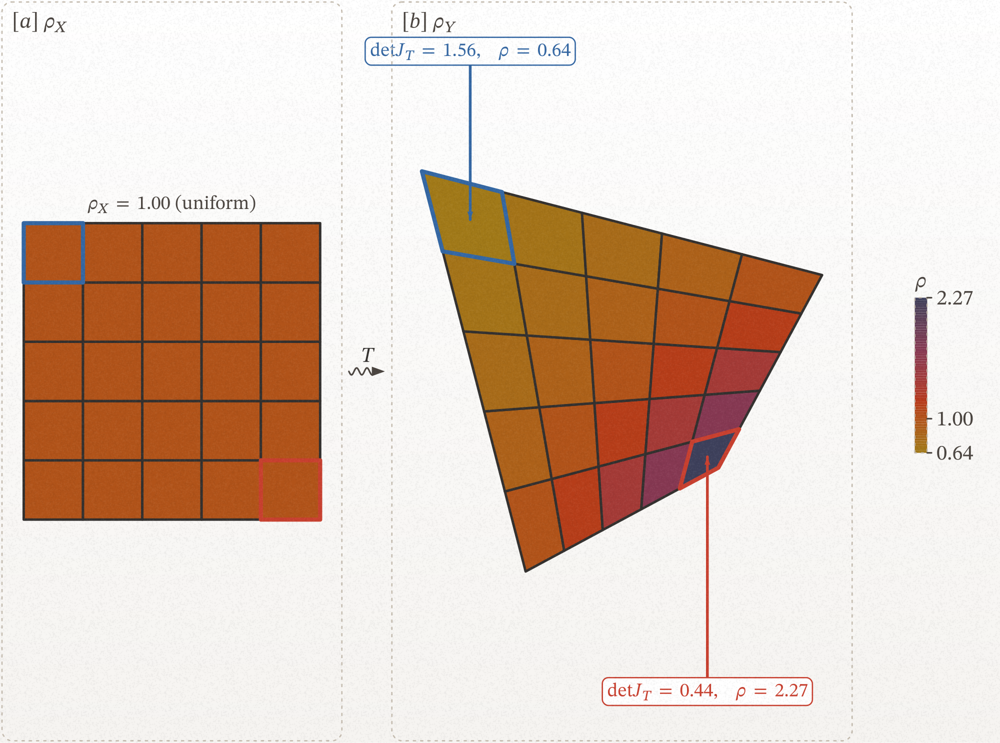

**Claim.** Mass is conserved under a pushforward, area is not: pushing a uniform density through a nonlinear map T, each cell's image density equals the source density divided by that cell's own |det J_T| — the cell that grows gets visibly lighter, the cell that shrinks visibly darker, read straight off the drawn polygons' shoelace areas.

Every normalizing-flow paper writes down log p_Y(y) = log p_X(x) -
log|det J_T(x)| as a single line of bookkeeping, and it is easy to read
past it as a correction term rather than see what it is actually doing.
Probability is a measure -- mass assigned to a set -- not a function value
carried along by a map, so when a transformation T pushes a density
forward, the density at the image point has to be divided by how much the
map locally stretched or compressed area, because the SAME mass now
occupies a different amount of space. A reader who has only manipulated
the change-of-variables formula algebraically needs to see it happen on an
actual grid: a uniform density pushed through a nonlinear shear, where the
cells that expand visibly lighten and the cells that contract visibly
darken, and where that lightening or darkening is exactly the reciprocal
of the cell's own area ratio -- not an approximation of it. Get the sign or
the determinant wrong in an implementation and the model silently
mis-normalizes; this figure is the geometry that makes the correct
bookkeeping visible instead of assumed.

[svg](probability/pushforward_density.svg) · [transparent svg](probability/pushforward_density_transparent.svg) · [readback](probability/pushforward_density.readback.md)

---

## statmech

*Order parameters and phase transitions.*

### ising_transition

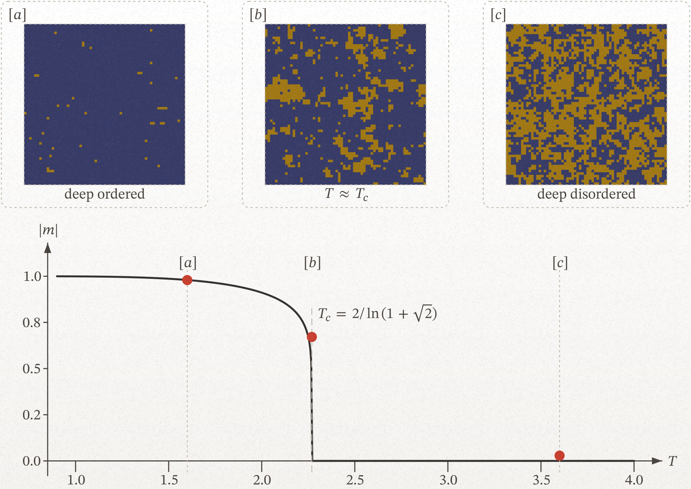

**Claim.** The 2D Ising magnetisation |m(T)| vanishes CONTINUOUSLY at T_c = 2/ln(1+sqrt2) via the exact Onsager law, and only exactly at T_c does a sampled spin configuration show clusters at every scale — the ordered and disordered configurations either side do not.

The statistical-mechanics account of a continuous phase transition rests
on two claims that are easy to state and hard to make convincing in prose:
the order parameter falls to zero smoothly rather than jumping, and the
system's spatial structure changes qualitatively as the transition is
approached, developing correlations at every length scale exactly at the
critical point. For the 2D Ising model, Onsager's exact solution gives the
magnetisation |m(T)| as a curve that touches zero at T_c with a genuine
critical exponent rather than a kink or a discontinuity, and a reader
needs to see that touch happen on the page to believe "continuous" means
something more specific than "not a jump". The second claim needs its own
evidence entirely separate from the curve: sampled spin configurations well
below T_c form one dominant domain, well above T_c look like salt-and-pepper
noise, and only at T_c does the configuration show clusters of aligned
spins at every scale simultaneously -- the visual signature of scale
invariance at a critical point, and the reason phase transitions are the
bridge between statistical mechanics and renormalization-group theory.

[svg](statmech/ising_transition.svg) · [transparent svg](statmech/ising_transition_transparent.svg) · [readback](statmech/ising_transition.readback.md)

---

## infotheory

*Typicality, and why the mode is not the story.*

### typical_set

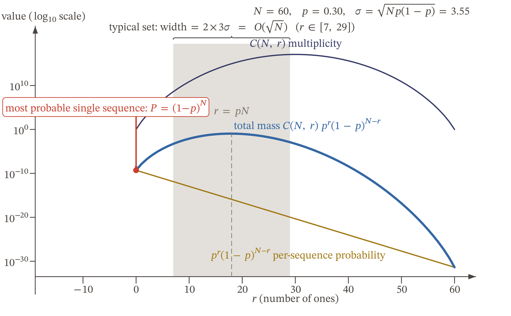

**Claim.** For N i.i.d. Bernoulli(p) draws with p < 1/2, the all-zeros sequence (r = 0 ones) is individually the most probable single sequence, but it lies outside the typical set -- the band of width O(sqrt(N)) centered at r = pN that carries essentially all the probability mass -- because the multiplicity C(N,r), which rises toward r = N/2, and the per-sequence probability p^r(1-p)^(N-r), which falls monotonically, trade off there and nowhere else.

MacKay's asymptotic equipartition argument (Information Theory, Inference,
and Learning Algorithms, ch. 4) is the sharpest counterexample to the
instinct that "most probable" and "typical" are the same idea. Take N
tosses of a p-biased coin. The single most probable OUTCOME -- the exact
sequence with the highest probability of all 2^N sequences -- is all
zeros when p < 1/2, since every 1 costs a factor p/(1-q) < 1 relative to
a 0. But almost none of the PROBABILITY lives there. Group sequences by
r, the number of ones: there are C(N,r) sequences in that group, each
individually carrying probability p^r(1-p)^(N-r). The group's total mass
is their product, and as r moves away from 0 the multiplicity explodes
combinatorially (a distinct fact, driven by log2 C(N,r) approximately
N*H(r/N)) far faster than the per-sequence probability decays, so the
mass climbs even as each individual sequence in the group gets less
likely. The two trends only balance -- log(count) rising with slope
log((N-r)/r), log(probability) falling with constant slope log(p/(1-p))
-- at r near pN, and it is there, in a band of width O(sqrt(N)), that
essentially all of the probability concentrates. The all-zeros string
sits at r = 0: the highest point on the probability-per-sequence curve,
and by the time the group sizes are weighted in, a vanishingly small
contributor to the total. This is the seed of the source coding theorem:
a random N-bit message from the source lands, with overwhelming
probability, in this typical set, so log2(size of the typical set) --
not log2(2^N) -- is the number of bits actually needed to describe it.

[svg](infotheory/typical_set.svg) · [transparent svg](infotheory/typical_set_transparent.svg) · [readback](infotheory/typical_set.readback.md)

---

## circuits

*Transformer internals as computation graphs.*

### induction_head_circuit

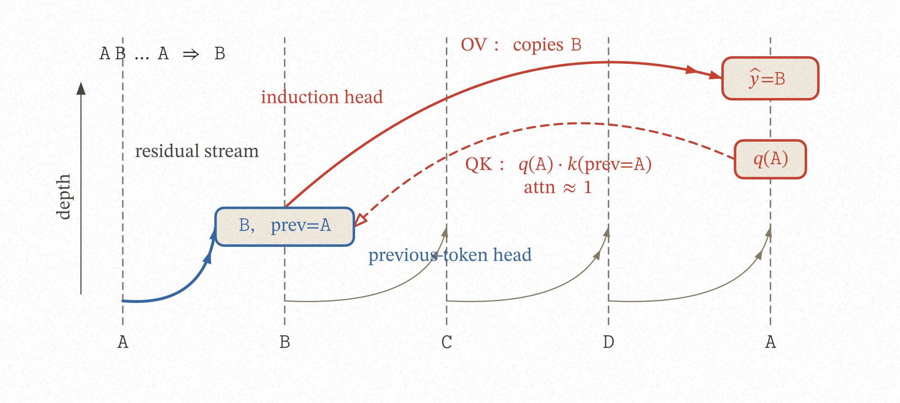

**Claim.** An induction head predicts the next token by attending to the position immediately AFTER an earlier occurrence of the current token — it can do that because a previous-token head has already written 'my predecessor was A' into that position's residual stream, which is exactly the key the induction head's query matches — and then copying whatever token sits there into the output.

Olsson et al., "In-context Learning and Induction Heads"
(transformer-circuits.pub, 2022), trace a sharp bend in the training
loss curve of every transformer they looked at -- a phase change,
visible in the raw curve before any circuit analysis is done -- to a
single mechanism appearing at that exact point in training. The
mechanism needs two heads at two different layers to compose, and
neither head alone explains anything: a previous-token head at an
early layer writes "the token before me was A" into the residual
stream at every position, and an induction head at a later layer forms
a query from the CURRENT token, matches it against those written
keys -- not against the tokens themselves -- and copies whatever
token sat one position after the match. The composition is what does
the work: it is what lets the induction head generalize to sequences
and tokens it has never seen, because the previous-token head's write
is available at inference time regardless of vocabulary. The
prose version of this -- "attends to the token after an earlier
occurrence of the current token" -- reads as a description of a single
attention pattern, and hides that the pattern is only possible because
an earlier layer already computed and stored the thing being matched
against. The figure exists to make that composition, not the attention
pattern alone, the object in view: which layer writes, what it writes,
and which layer's query is built to read exactly that.

[svg](circuits/induction_head_circuit.svg) · [transparent svg](circuits/induction_head_circuit_transparent.svg) · [readback](circuits/induction_head_circuit.readback.md)

---

### qk_circuit_tensor

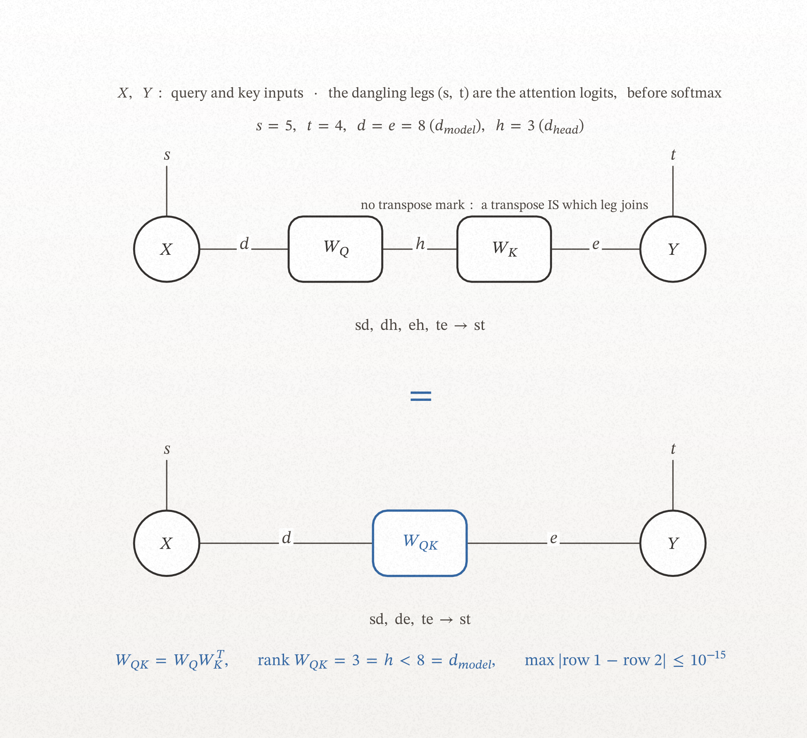

**Claim.** Attention's query and key projections are not two mechanisms: they meet along the head axis, so X W_Q W_K^T X^T and X W_QK X^T are the same array for W_QK = W_Q W_K^T — a single bilinear form of rank 3, the head width, inside an 8-dimensional model.

Elhage et al., "A Mathematical Framework for Transformer Circuits"
(transformer-circuits.pub, 2021), name the QK circuit as one of the two
low-rank linear maps an attention head reduces to once the softmax is
factored out, and the naming carries a claim that is easy to read past:
W_Q and W_K never appear separately anywhere downstream of the
attention pattern, only as the product W_Q W_K^T. Nothing later in the
network -- not the softmax, not the OV circuit, not any subsequent
layer -- has a way to observe the head axis that W_Q and W_K were each
projected into; it is summed out before anything else happens. So
"queries" and "keys" are not two learned mechanisms with independent
meaning, they are a rank-d_head factorization of one bilinear form, and
the factorization is a parameterization choice, not a structural fact
about what the head computes. This matters wherever a factored
representation gets read as if the factors themselves were meaningful
-- interpreting W_Q or W_K in isolation, or expecting two heads with
similar attention patterns to have similar per-matrix weights when only
their product needs to agree. The figure draws both descriptions as
tensor networks specifically to make the head axis's disappearance a
visible fact about the diagram -- a wire present in one row and gone
in the other -- rather than an algebraic identity the reader has to
take on faith.

[svg](circuits/qk_circuit_tensor.svg) · [transparent svg](circuits/qk_circuit_tensor_transparent.svg) · [readback](circuits/qk_circuit_tensor.readback.md)

---

### qk_score_derivation

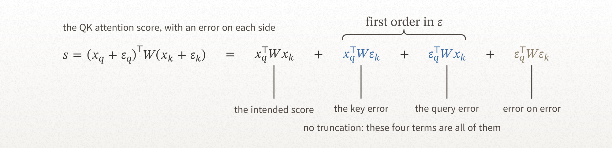

**Claim.** A QK attention score computed on perturbed vectors decomposes exactly into four interaction terms — the intended signal-signal score, two cross terms that pair a full-size signal against an error, and one error-error term — so the corruption of an attention score is, to leading order, the two cross terms and nothing else.

The question this figure serves comes up wherever an attention score has to
survive a perturbation of its inputs -- quantization, activation noise, a
patched residual stream, an adversarial nudge. The usual move is to bound the
whole score and stop, which answers "how wrong can it get" without answering
"wrong in which direction, and carried by what". Expanding the bilinear form
q^T W k on q = s_q + e_q and k = s_k + e_k answers the second question, and the
answer is structural rather than numerical: the score splits into exactly four
interaction terms and no others.

What the reader has to believe is that the list of four is closed and that its
members are not the same size. Written as prose the expansion is a list, and a
list gives no reason to trust either fact. Written as one row of typeset terms
at their real widths, exhaustiveness is something you see -- the row closes --
and the two cross terms, each pairing a full-size signal against an error, sit
where they can be picked out and pointed at. The error-error term is visibly
second order. That is the whole argument: to leading order the corruption of an
attention score is those two cross terms and nothing else.

[svg](circuits/qk_score_derivation.svg) · [transparent svg](circuits/qk_score_derivation_transparent.svg) · [readback](circuits/qk_score_derivation.readback.md)

---

### schematic_transformer_block

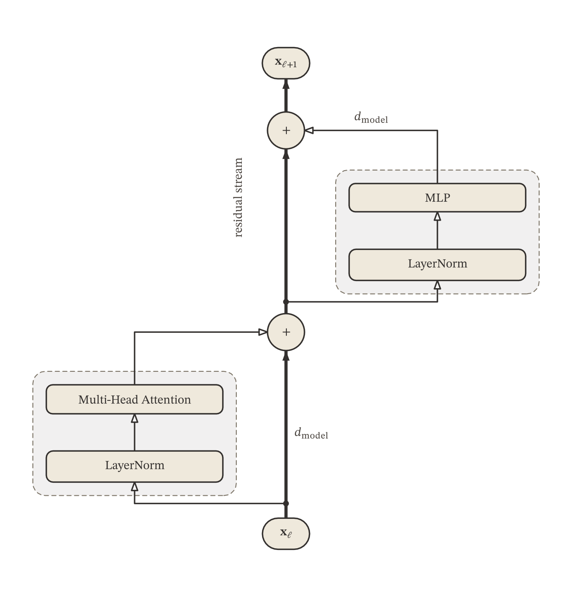

**Claim.** In a pre-norm transformer block the residual stream is the main path and nothing sits on it: attention and the MLP are branches that READ a normalized copy of the stream and ADD their output back, so the LayerNorms never touch what is carried forward and every write is the same d_model width as the stream it is added to.

Elhage et al., "A Mathematical Framework for Transformer Circuits"
(transformer-circuits.pub, 2021), open by discarding the layer diagram
everyone draws first. A transformer is not a stack of stages each
consuming the last; it is a residual stream -- a d_model-wide vector
per token, read and written additively by every attention head and MLP
in the network -- with each sublayer's output a small perturbation on
top of an otherwise-untouched channel. That reframing is what makes the
rest of the paper's math work: because every layer's contribution is
additive, the network's output decomposes into a sum over paths through
the stream, and a path can be analyzed in isolation from every other
one. The framework's central objects -- QK and OV circuits, induction
heads, virtual attention heads formed by composing two real ones -- are
all statements about what gets written to the stream and what a later
layer reads back out of it, and none of them are visible in the
box-and-arrow pipeline picture. This figure draws the one fact the
prose states but the pipeline diagram hides: LayerNorm is inside the
branch, not on the spine, so what the next sublayer reads is a
normalized copy while what survives to the end of the network is the
raw sum. Getting that ordering backwards -- treating the normalized
stream as what persists -- silently breaks the additive decomposition
the whole framework depends on.

[svg](circuits/schematic_transformer_block.svg) · [transparent svg](circuits/schematic_transformer_block_transparent.svg) · [readback](circuits/schematic_transformer_block.readback.md)

---
