# Figure gallery

33 figures. Generated by `make gallery` — **do not edit.**

Each card shows the cream render because it reads better as a card; the transparent SVG is the one to embed in a document.

## complex

*Conformal maps, the Riemann sphere, contour integration.*

### amplitwist

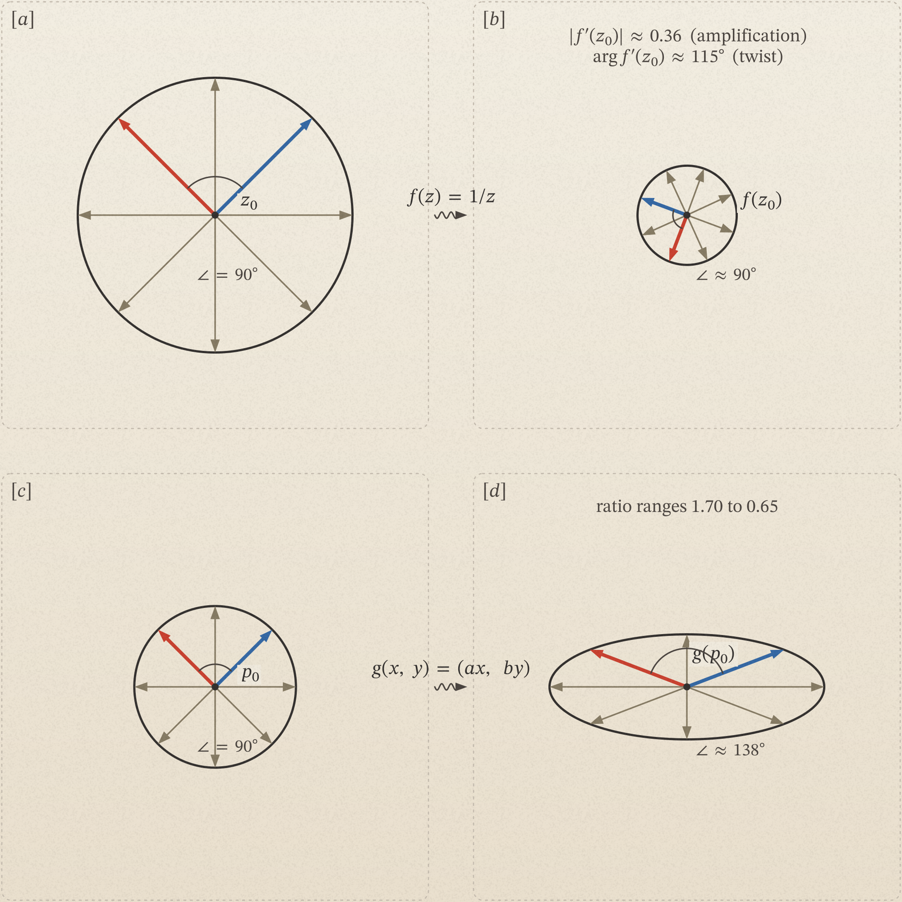

**Claim.** An analytic map with f'(z0) != 0 amplifies and twists an infinitesimal disc by the SAME factor and angle in every direction (an amplitwist); a non-analytic R^2 -> R^2 map with unequal singular values does not, and sends the disc to an ellipse instead.

_(no EXPOSITION yet)_

[transparent svg](complex/amplitwist.svg) · [cream svg](complex/amplitwist_paper.svg) · [readback](complex/amplitwist.readback.md)

---

### contour_deformation

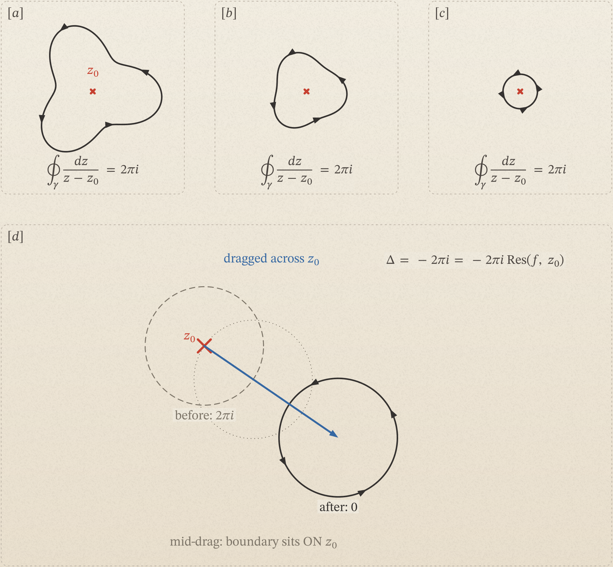

**Claim.** The integral of f(z) = Res/(z - z0) around a closed loop depends only on the loop's homotopy class relative to z0, not on its shape: three visibly different loops enclosing z0 all carry the identical value 2 pi i * Res, while dragging that same loop bodily across z0 instead of shrinking it around z0 changes the value discontinuously, by exactly 2 pi i * Res, at the one instant the boundary sweeps over the pole.

_(no EXPOSITION yet)_

[transparent svg](complex/contour_deformation.svg) · [cream svg](complex/contour_deformation_paper.svg) · [readback](complex/contour_deformation.readback.md)

---

### demo_flow_past_cylinder

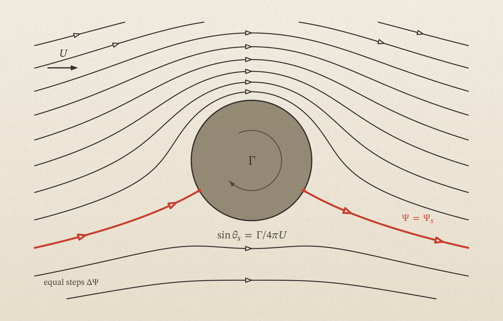

**Claim.** Circulation slides both stagnation points down the cylinder to sin(theta_s) = Gamma/4piU and crowds the equally spaced Psi-levels over the top: the flux-tube density is the speedup that generates lift.

_(no EXPOSITION yet)_

[transparent svg](complex/demo_flow_past_cylinder.svg) · [cream svg](complex/demo_flow_past_cylinder_paper.svg) · [readback](complex/demo_flow_past_cylinder.readback.md)

---

### demo_panels_zsquared

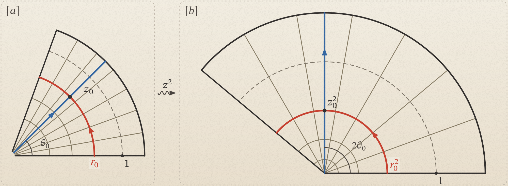

**Claim.** The mapping z -> z^2 doubles every angle and squares every modulus: a polar sector of opening theta_max maps to one of opening 2*theta_max, the ray at theta_0 lands on the ray at 2*theta_0, the circle of radius r_0 < 1 contracts to radius r_0^2, and the unit circle maps to itself.

_(no EXPOSITION yet)_

[transparent svg](complex/demo_panels_zsquared.svg) · [cream svg](complex/demo_panels_zsquared_paper.svg) · [readback](complex/demo_panels_zsquared.readback.md)

---

### demo_sphere_stereographic

**Claim.** Stereographic projection from the north pole N sends a point p of the plane outside the unit circle to the point p-hat where the ray N->p pierces the northern hemisphere of the unit sphere; the equator is the unit circle itself and its points are fixed — the line through p crosses the unit circle at two points and its image circle passes through the same two points; a straight line through p maps to a circle through N, so p -> infinity drives p-hat -> N.

_(no EXPOSITION yet)_

[transparent svg](complex/demo_sphere_stereographic.svg) · [cream svg](complex/demo_sphere_stereographic_paper.svg) · [readback](complex/demo_sphere_stereographic.readback.md)

---

### fig09_exp_series_spiral

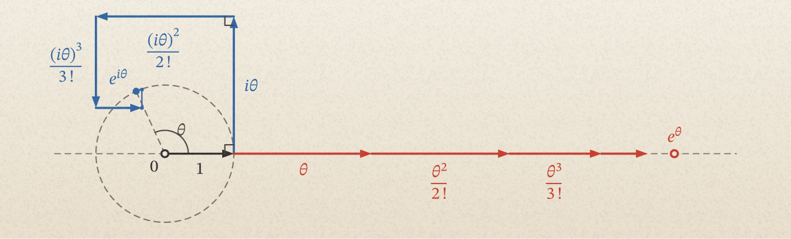

**Claim.** The partial sums of the power series for e^z, evaluated at z = iθ, turn a right angle at every step and spiral into the point e^{iθ} on the unit circle, while the same series at real z = θ moves straight along the real axis toward e^θ.

_(no EXPOSITION yet)_

[transparent svg](complex/fig09_exp_series_spiral.svg) · [cream svg](complex/fig09_exp_series_spiral_paper.svg) · [readback](complex/fig09_exp_series_spiral.readback.md)

---

### inversion_in_circle

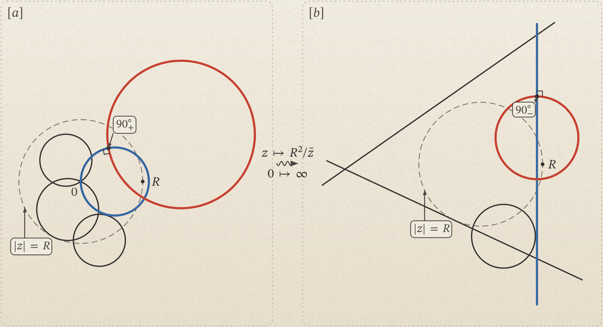

**Claim.** Inversion z -> R^2/z-bar sends circles through the center of inversion to lines, circles that miss the center to circles, fixes the circle |z| = R pointwise, and preserves the angle at which two curves cross in magnitude while reversing its sense -- so an orthogonal pair of circles stays orthogonal, a right angle mapping to a right angle of the opposite hand.

Needham introduces inversion in a circle (Visual Complex Analysis, ch. 3)
as the geometric ancestor of the Mobius transformations: not z -> R^2/z,
which is holomorphic and orientation-preserving, but z -> R^2/z-bar, built
from conjugation -- reflection in the real axis -- composed with the
holomorphic inversion. Conjugation reverses orientation and leaves
Mobius geometry untouched, so the composite is anticonformal: it still
preserves the magnitude of every angle between crossing curves, but flips
its sign. Needham's punchline is that this single map already carries
the whole circle-preserving machinery of Mobius transformations, in its
starkest form: every circle or line (a "circline") maps to a circline,
the circle of inversion |z| = R survives as the fixed locus, and nothing
outside that locus is fixed -- points swap the inside of the circle for
the outside along each ray. The figure asks for the one picture that
makes every clause checkable at once: a family of circles through the
center becoming lines, a family that misses the center staying round, and
a single orthogonal crossing surviving the map with its right angle
intact but its handedness reversed.

[transparent svg](complex/inversion_in_circle.svg) · [cream svg](complex/inversion_in_circle_paper.svg) · [readback](complex/inversion_in_circle.readback.md)

---

### mobius_classification

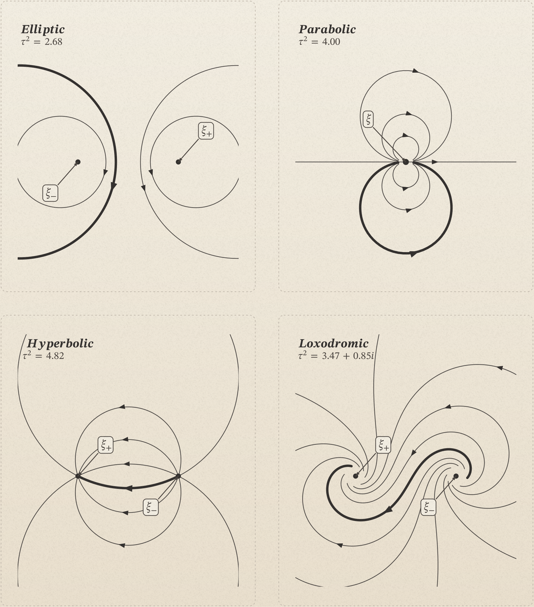

**Claim.** The normalized trace of a Mobius transformation's matrix, tau^2 = tr(M)^2 / det(M), predicts its invariant orbit geometry outright: tau^2 in [0,4) draws closed circles around two centers (elliptic), tau^2 = 4 draws a family tangent at one point (parabolic), real tau^2 > 4 draws arcs flowing source to sink (hyperbolic), and non-real tau^2 draws spirals winding around both poles (loxodromic) -- no case-by-case argument, one number.

Needham's classification of Mobius transformations (Visual Complex
Analysis, ch. 3, "Classification of Mobius Transformations") turns on a
single invariant. Conjugate M to its normal form by sending its fixed
points to 0 and infinity -- F M F^{-1} becomes the elementary map
w -> m w for a complex multiplier m -- and Needham shows the whole
qualitative behaviour of M is read off m alone: |m| = 1 rotates,
m real =/= 1 flows radially, m off the unit circle and off the positive
reals spirals, m = 1 is the one degenerate case with a single fixed
point. What ties this back to M itself, rather than to the coordinates
F happened to choose, is that m is pinned down by tau^2 = tr(M)^2 /
det(M) = m + 1/m + 2 -- the trace-squared-over-determinant is exactly
the quantity invariant under conjugation and rescaling the matrix, so it
depends on M and nothing else. The reader is left, after that one
equation, to reconstruct four qualitatively different pictures from
memory. This figure is the picture the algebra earns but the book leaves
to the reader's imagination: the same four-step construction --
factor the matrix, solve for m from tau^2, draw the orbit family in
normal coordinates, pull it back through F^{-1} -- run once per panel,
so that "trace alone decides the geometry" is something the page shows
rather than the algebra merely implies.

[transparent svg](complex/mobius_classification.svg) · [cream svg](complex/mobius_classification_paper.svg) · [readback](complex/mobius_classification.readback.md)

---

### poincare_disc

**Claim.** Through a point P off a hyperbolic line L there are infinitely many geodesics that never meet L -- bounded by two limiting parallels asymptotic to L's own ideal endpoints -- where Euclidean geometry permits exactly one.

_(no EXPOSITION yet)_

[transparent svg](complex/poincare_disc.svg) · [cream svg](complex/poincare_disc_paper.svg) · [readback](complex/poincare_disc.readback.md)

---

### vca_fig12_flow_grid

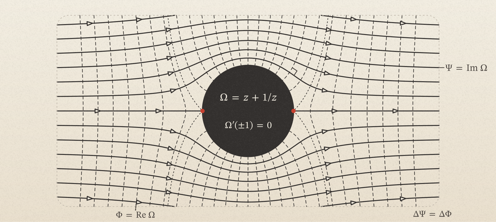

**Claim.** The level curves of Psi = Im Omega and Phi = Re Omega for Omega = z + 1/z form an orthogonal grid of near-squares that flows around the disc and breaks down only at the stagnation points +-1, where the map ceases to be conformal.

_(no EXPOSITION yet)_

[transparent svg](complex/vca_fig12_flow_grid.svg) · [cream svg](complex/vca_fig12_flow_grid_paper.svg) · [readback](complex/vca_fig12_flow_grid.readback.md)

---

### vca_fig14_volcanoes

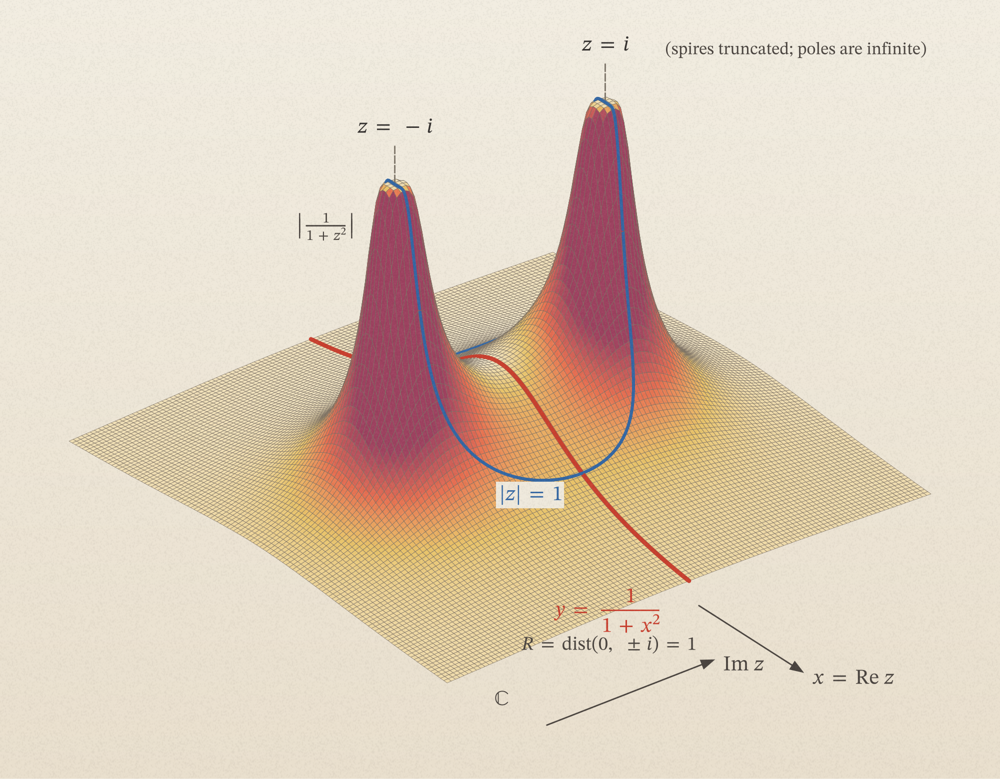

**Claim.** The graph of 1/(1+x^2) is the tranquil real-axis slice of the modular surface of 1/(1+z^2), which erupts to infinity at the poles z = +-i; the Taylor series of the real function at 0 therefore converges only up to distance 1 — the distance to the invisible complex poles.

_(no EXPOSITION yet)_

[transparent svg](complex/vca_fig14_volcanoes.svg) · [cream svg](complex/vca_fig14_volcanoes_paper.svg) · [readback](complex/vca_fig14_volcanoes.readback.md)

---

### vca_fig30_elliptic_checkerboard

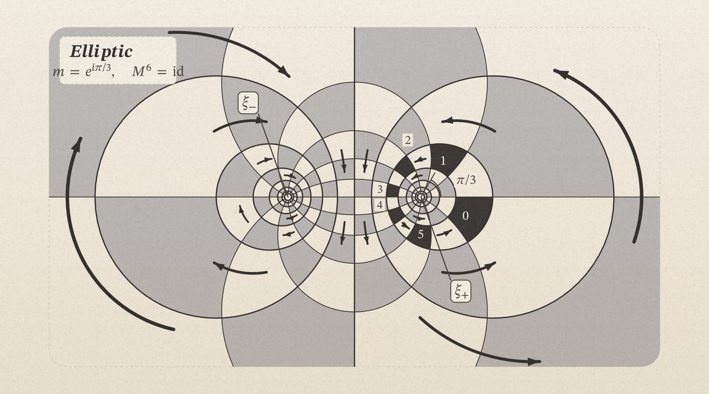

**Claim.** An elliptic Mobius transformation rotates the whole plane along the invariant Apollonian circles about its two fixed points, each application advancing every cell of the bipolar net by the fixed multiplier angle pi/3 -- so the black orbit of one cell closes after six steps: M^6 = id.

_(no EXPOSITION yet)_

[transparent svg](complex/vca_fig30_elliptic_checkerboard.svg) · [cream svg](complex/vca_fig30_elliptic_checkerboard_paper.svg) · [readback](complex/vca_fig30_elliptic_checkerboard.readback.md)

---

### vca_fig4_zn_polar_grid

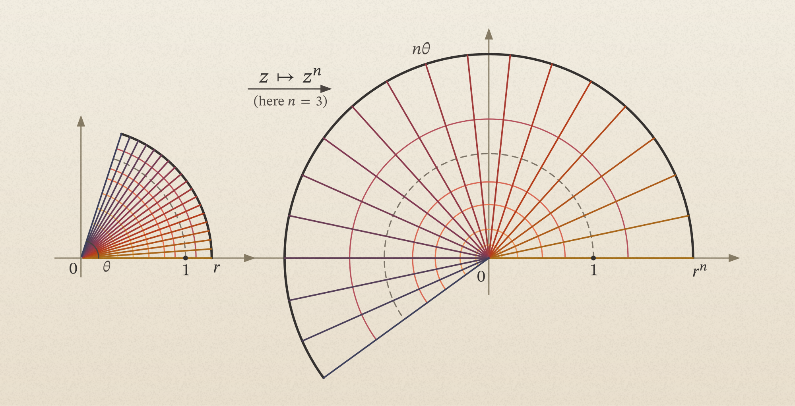

**Claim.** The mapping z -> z^3 sends each ray at angle theta to the ray at angle 3*theta and each circular arc of radius r to the arc of radius r^3, so a polar-grid sector opens out into a fan three times as wide while every grid intersection stays a right angle.

_(no EXPOSITION yet)_

[transparent svg](complex/vca_fig4_zn_polar_grid.svg) · [cream svg](complex/vca_fig4_zn_polar_grid_paper.svg) · [readback](complex/vca_fig4_zn_polar_grid.readback.md)

---

### vca_fig9_cassinian

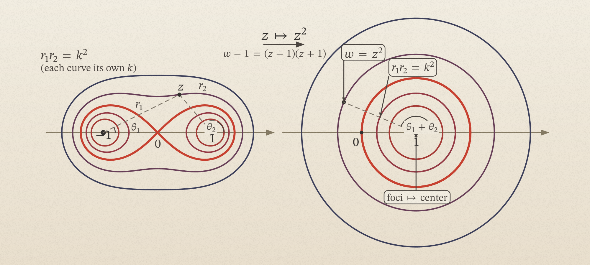

**Claim.** The Cassinian curves |z-1||z+1| = k^2 with foci +-1 are exactly the preimages under w = z^2 of the concentric circles |w-1| = k^2, with the k=1 lemniscate mapping to the circle through the origin.

_(no EXPOSITION yet)_

[transparent svg](complex/vca_fig9_cassinian.svg) · [cream svg](complex/vca_fig9_cassinian_paper.svg) · [readback](complex/vca_fig9_cassinian.readback.md)

---

### winding_number

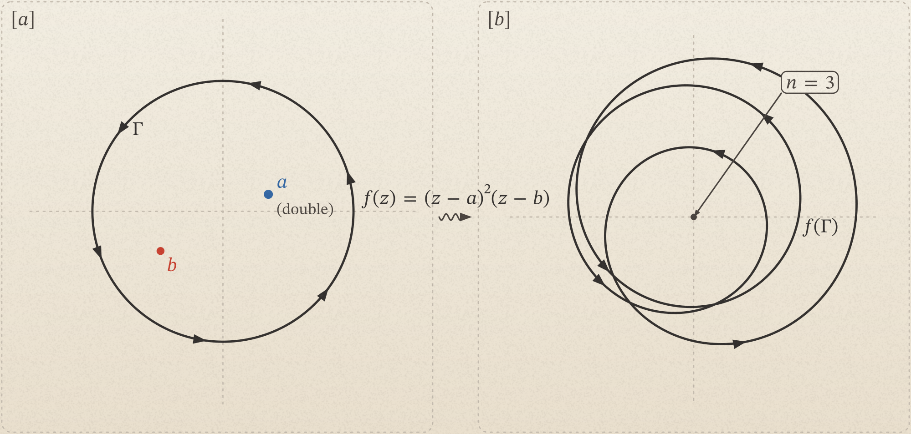

**Claim.** As z traces Gamma once counterclockwise, f(z) = (z-a)^2 (z-b) traces a closed curve that winds around w = 0 exactly three times — twice for the double zero at a, once for the simple zero at b — because the winding number of f(Gamma) equals the enclosed zero count with multiplicity.

_(no EXPOSITION yet)_

[transparent svg](complex/winding_number.svg) · [cream svg](complex/winding_number_paper.svg) · [readback](complex/winding_number.readback.md)

---

## signals

*Sampling, spectra, and the geometry of transfer functions.*

### dft_matrix_basis

**Claim.** The 8-point DFT matrix is a basis gallery: column k, drawn as a mini waveform, is the complex exponential of frequency k sampled at n = 0..7 and generated by the k-th root of unity (same hue); the signal x[n] = cos(2 pi 2n/8) + 0.4 sin(2 pi 3n/8) is the hue-matched weighted sum of exactly the columns its spectrum |X_k| lights up, and F is unitary up to 1/8.

_(no EXPOSITION yet)_

[transparent svg](signals/dft_matrix_basis.svg) · [cream svg](signals/dft_matrix_basis_paper.svg) · [readback](signals/dft_matrix_basis.readback.md)

---

### polezero_response

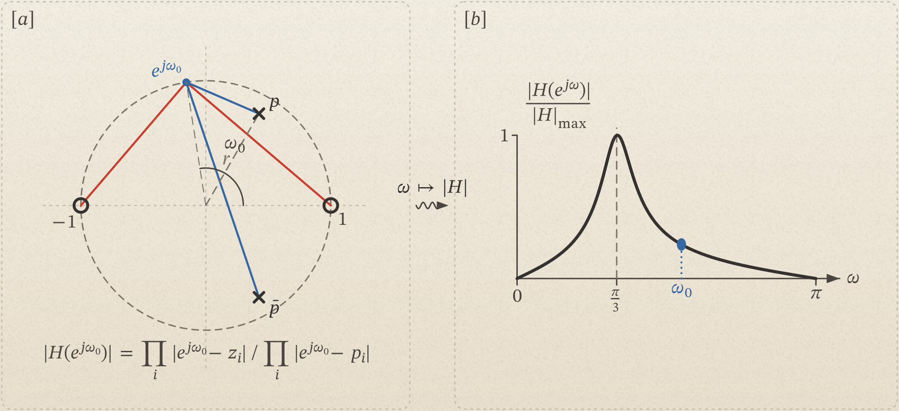

**Claim.** The magnitude response of H(z) is read geometrically off the z-plane: at each omega, |H(e^{j omega})| is the product of the distances from e^{j omega} to the zeros divided by the product of the distances to the poles — so the conjugate pole pair at radius 0.85 and angle pi/3 carves a resonance peak at omega = pi/3, and the zeros at z = +-1 pin nulls at omega = 0 and pi.

_(no EXPOSITION yet)_

[transparent svg](signals/polezero_response.svg) · [cream svg](signals/polezero_response_paper.svg) · [readback](signals/polezero_response.readback.md)

---

### sampling_aliasing

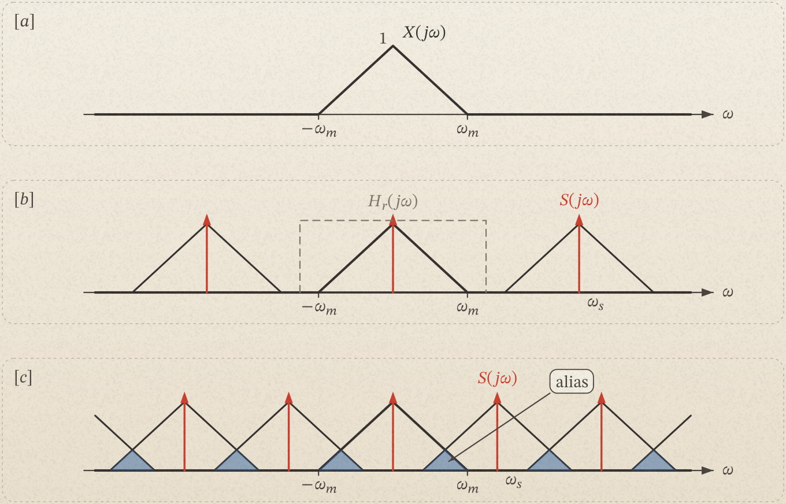

**Claim.** Sampling at rate omega_s convolves a spectrum with an impulse comb of spacing omega_s, replicating the triangle at every multiple of omega_s; the replicas stay separated exactly when omega_s > 2*omega_m, and when omega_s < 2*omega_m adjacent replicas overlap in a band of width 2*omega_m - omega_s where the spectrum is unrecoverable.

_(no EXPOSITION yet)_

[transparent svg](signals/sampling_aliasing.svg) · [cream svg](signals/sampling_aliasing_paper.svg) · [readback](signals/sampling_aliasing.readback.md)

---

## linalg

*Matrices as geometry: the four readings, low rank, conditioning.*

### conditioning_ellipse

**Claim.** A maps the unit circle to an ellipse with semi-axes sigma_1 >= sigma_2 along the left singular vectors u_1, u_2: a unit-size input perturbation is stretched by a factor that ranges over [sigma_2, sigma_1] depending only on its direction, and the ratio between the best-conditioned direction (v_1, stretched by sigma_1) and the worst -- the flat direction v_2, stretched by only sigma_2 -- is exactly kappa = sigma_1 / sigma_2, attained, not merely bounded.

This is the standard picture behind Trefethen & Bau's treatment of
conditioning (Lecture 12): every linear map's relative sensitivity to
perturbation is governed by the SVD, and the geometry makes the bound
visible instead of algebraic. Feed A the unit circle and read off the
image: it is an ellipse, its semi-axes are the singular values, its axis
directions are the left singular vectors. That picture already contains
the whole conditioning story. A unit perturbation applied along v_1 comes
out as sigma_1 u_1 -- the long axis, the direction A stretches most, the
best-conditioned direction because the map's action there is easiest to
undo. The same-size perturbation applied along v_2 comes out as only
sigma_2 u_2 -- the flat direction, where A compresses instead of
amplifying, so recovering that perturbation from the output means
dividing by the smallest possible gain and any noise in the output gets
amplified the most on the way back. Every other direction lands strictly
between these two extremes (a Rayleigh-quotient fact, not a hope), so the
ratio of worst to best -- kappa = sigma_1/sigma_2 -- is not a loose
worst-case estimate: it is exactly attained by this one pair of rays, and
no direction does worse. The figure draws both the range and its two
attaining endpoints, so the bound and its tightness are the same claim.

[transparent svg](linalg/conditioning_ellipse.svg) · [cream svg](linalg/conditioning_ellipse_paper.svg) · [readback](linalg/conditioning_ellipse.readback.md)

---

### matrix_four_views

**Claim.** A matrix has four readings — one whole, mn entries, n columns, m rows — and choosing the column-and-row reading is what turns the product AB into a sum of rank-1 matrices, one per column of A paired with the matching row of B.

_(no EXPOSITION yet)_

[transparent svg](linalg/matrix_four_views.svg) · [cream svg](linalg/matrix_four_views_paper.svg) · [readback](linalg/matrix_four_views.readback.md)

---

### svd_low_rank

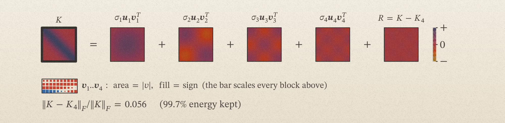

**Claim.** A smooth Gaussian kernel matrix is nearly rank 4: drawn exactly as K = sum_{k<=4} sigma_k u_k v_k^T + R, its four rank-1 modes are signed and oscillate at rising frequency like a Fourier basis, and the residual R is visibly flat at the same color scale as K — 5.6% relative Frobenius error, 99.7% of the energy kept.

_(no EXPOSITION yet)_

[transparent svg](linalg/svd_low_rank.svg) · [cream svg](linalg/svd_low_rank_paper.svg) · [readback](linalg/svd_low_rank.readback.md)

---

## dynamics

*Flows, bifurcations, and stochastic trajectories.*

### demo_basin_wash

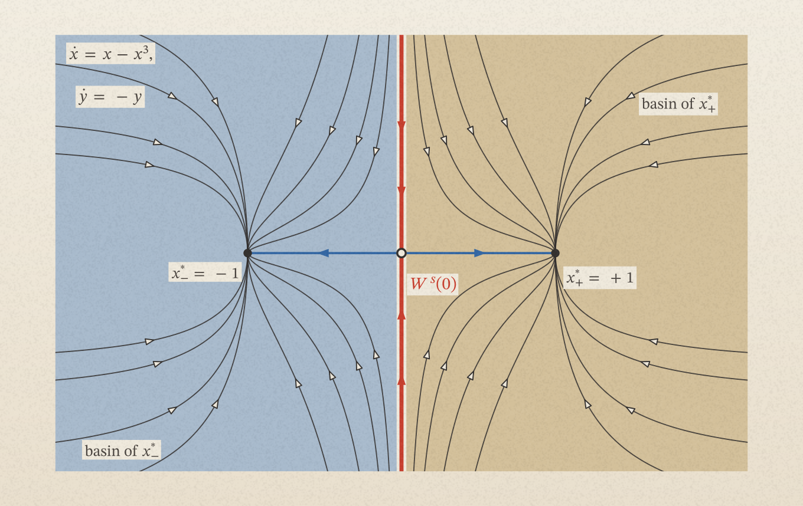

**Claim.** One curve of measure zero — the saddle's stable manifold, here the y-axis — splits the whole plane into the two basins of the double-well gradient flow; every trajectory off it ends at the sink of its side.

_(no EXPOSITION yet)_

[transparent svg](dynamics/demo_basin_wash.svg) · [cream svg](dynamics/demo_basin_wash_paper.svg) · [readback](dynamics/demo_basin_wash.readback.md)

---

### demo_ou_ensemble_field

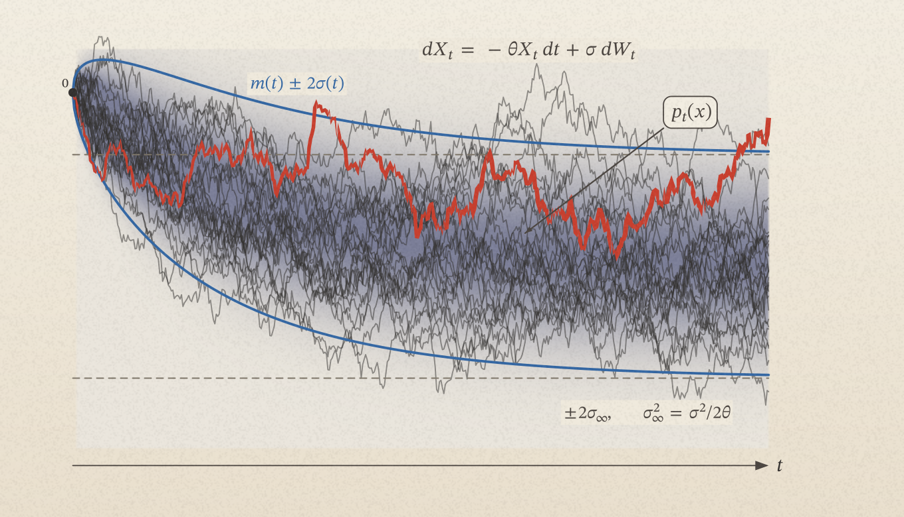

**Claim.** An OU ensemble's marginal p_t(x) contracts onto the stationary law N(0, sigma^2/2theta) while every individual sample path keeps fluctuating at full stationary amplitude — the density converges, the paths do not.

_(no EXPOSITION yet)_

[transparent svg](dynamics/demo_ou_ensemble_field.svg) · [cream svg](dynamics/demo_ou_ensemble_field_paper.svg) · [readback](dynamics/demo_ou_ensemble_field.readback.md)

---

### diffusion_ode_vs_sde

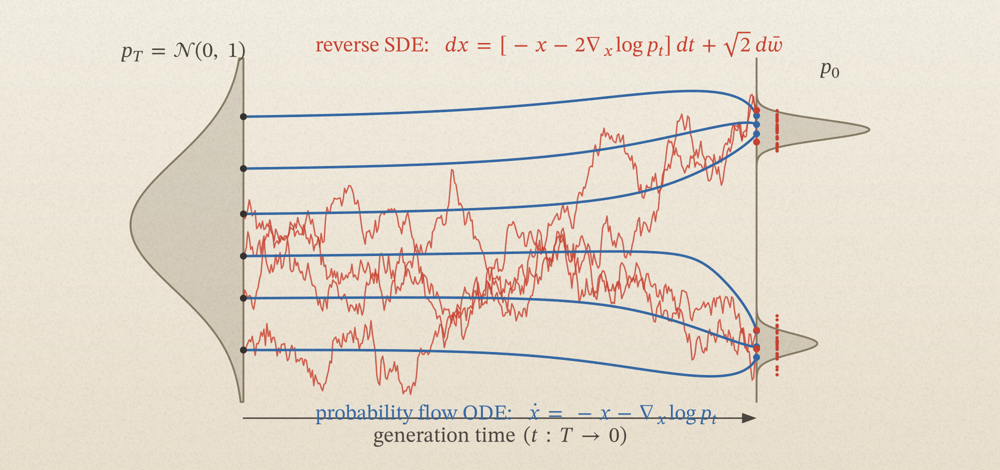

**Claim.** Starting from the same draws of pure noise, the jittery reverse-time SDE paths and the smooth deterministic probability-flow ODE paths of a diffusion model transport the standard-normal prior into the same two-mode data distribution, because both integrate the same score field and share the same marginals at every intermediate time.

_(no EXPOSITION yet)_

[transparent svg](dynamics/diffusion_ode_vs_sde.svg) · [cream svg](dynamics/diffusion_ode_vs_sde_paper.svg) · [readback](dynamics/diffusion_ode_vs_sde.readback.md)

---

### strogatz_saddle_node

**Claim.** In xdot = r + x^2 the two fixed points x* = -sqrt(-r) (stable) and x* = +sqrt(-r) (unstable) are the two crossings of a parabola that rides upward with r: as r -> 0 from below they approach, at r = 0 they merge into a single half-stable point, and for r > 0 the parabola has cleared the axis, so no fixed point exists and the flow is rightward everywhere.

_(no EXPOSITION yet)_

[transparent svg](dynamics/strogatz_saddle_node.svg) · [cream svg](dynamics/strogatz_saddle_node_paper.svg) · [readback](dynamics/strogatz_saddle_node.readback.md)

---

## optim

*What actually governs convergence.*

### illconditioned_descent

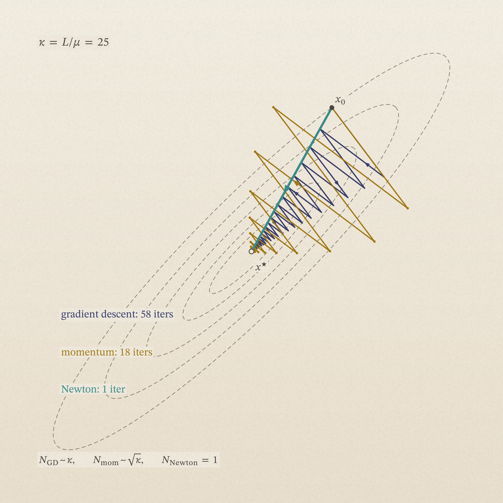

**Claim.** Gradient descent's iteration count is governed by the Hessian's condition number kappa, not the step size: on the same ill-conditioned quadratic, plain steepest descent needs ~kappa iterations to zig-zag to tolerance, heavy-ball momentum cuts that to ~sqrt(kappa) by damping the oscillation rather than shrinking the step, and Newton's method reaches the optimum in a single step because it rescales by the Hessian and so never sees kappa at all.

_(no EXPOSITION yet)_

[transparent svg](optim/illconditioned_descent.svg) · [cream svg](optim/illconditioned_descent_paper.svg) · [readback](optim/illconditioned_descent.readback.md)

---

## probability

*Densities under maps, and where the mass really lives.*

### concentration_of_measure

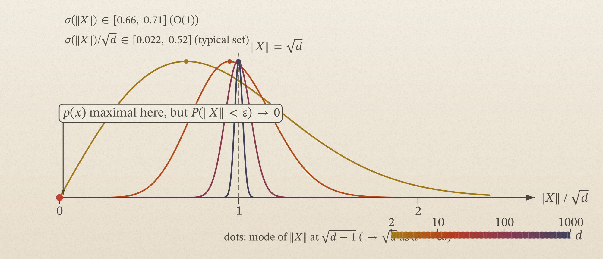

**Claim.** For X ~ N(0, I_d), the joint density p(x) is maximized at the origin, but the density of ||X|| vanishes there and instead concentrates tightly around sqrt(d): the shell's absolute width stays O(1) as d grows while its width relative to sqrt(d) shrinks like 1/sqrt(d), so the mode of p and the location of a typical sample pull apart.

_(no EXPOSITION yet)_

[transparent svg](probability/concentration_of_measure.svg) · [cream svg](probability/concentration_of_measure_paper.svg) · [readback](probability/concentration_of_measure.readback.md)

---

### pushforward_density

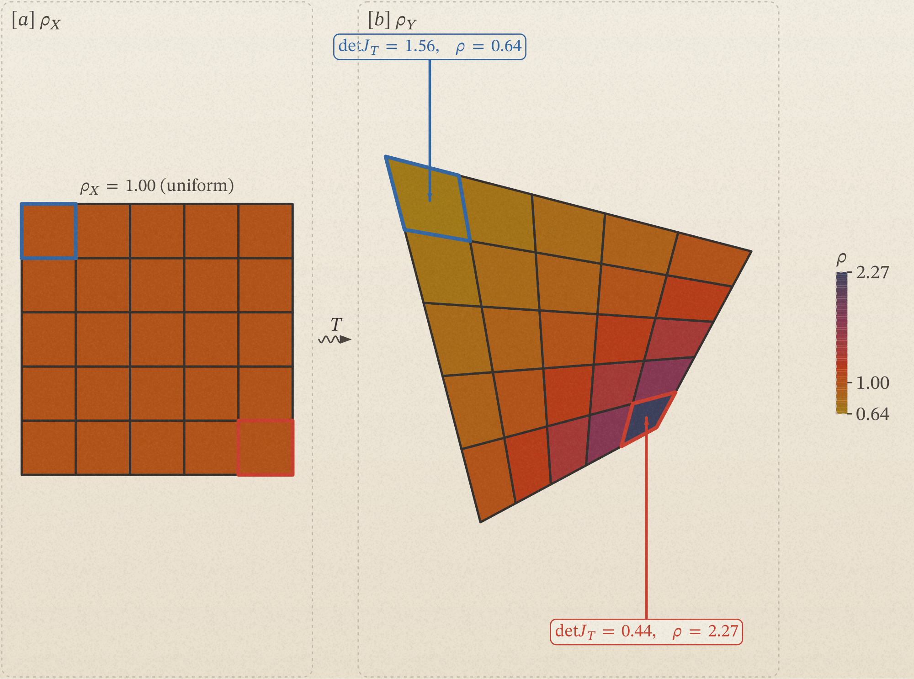

**Claim.** Mass is conserved under a pushforward, area is not: pushing a uniform density through a nonlinear map T, each cell's image density equals the source density divided by that cell's own |det J_T| — the cell that grows gets visibly lighter, the cell that shrinks visibly darker, read straight off the drawn polygons' shoelace areas.

_(no EXPOSITION yet)_

[transparent svg](probability/pushforward_density.svg) · [cream svg](probability/pushforward_density_paper.svg) · [readback](probability/pushforward_density.readback.md)

---

## statmech

*Order parameters and phase transitions.*

### ising_transition

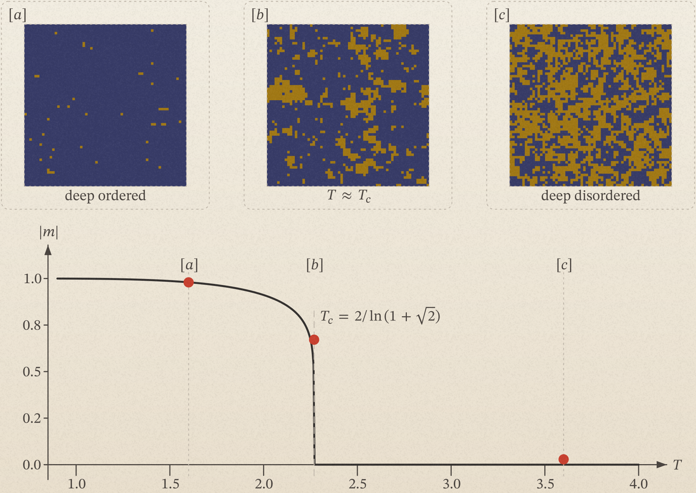

**Claim.** The 2D Ising magnetisation |m(T)| vanishes CONTINUOUSLY at T_c = 2/ln(1+sqrt2) via the exact Onsager law, and only exactly at T_c does a sampled spin configuration show clusters at every scale — the ordered and disordered configurations either side do not.

_(no EXPOSITION yet)_

[transparent svg](statmech/ising_transition.svg) · [cream svg](statmech/ising_transition_paper.svg) · [readback](statmech/ising_transition.readback.md)

---

## infotheory

*Typicality, and why the mode is not the story.*

### typical_set

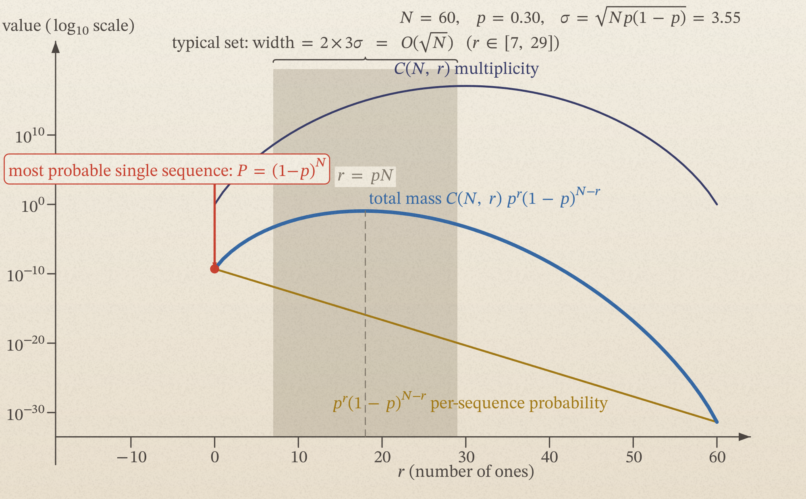

**Claim.** For N i.i.d. Bernoulli(p) draws with p < 1/2, the all-zeros sequence (r = 0 ones) is individually the most probable single sequence, but it lies outside the typical set -- the band of width O(sqrt(N)) centered at r = pN that carries essentially all the probability mass -- because the multiplicity C(N,r), which rises toward r = N/2, and the per-sequence probability p^r(1-p)^(N-r), which falls monotonically, trade off there and nowhere else.

MacKay's asymptotic equipartition argument (Information Theory, Inference,
and Learning Algorithms, ch. 4) is the sharpest counterexample to the
instinct that "most probable" and "typical" are the same idea. Take N
tosses of a p-biased coin. The single most probable OUTCOME -- the exact
sequence with the highest probability of all 2^N sequences -- is all
zeros when p < 1/2, since every 1 costs a factor p/(1-q) < 1 relative to
a 0. But almost none of the PROBABILITY lives there. Group sequences by
r, the number of ones: there are C(N,r) sequences in that group, each
individually carrying probability p^r(1-p)^(N-r). The group's total mass
is their product, and as r moves away from 0 the multiplicity explodes
combinatorially (a distinct fact, driven by log2 C(N,r) approximately
N*H(r/N)) far faster than the per-sequence probability decays, so the
mass climbs even as each individual sequence in the group gets less
likely. The two trends only balance -- log(count) rising with slope
log((N-r)/r), log(probability) falling with constant slope log(p/(1-p))
-- at r near pN, and it is there, in a band of width O(sqrt(N)), that
essentially all of the probability concentrates. The all-zeros string
sits at r = 0: the highest point on the probability-per-sequence curve,
and by the time the group sizes are weighted in, a vanishingly small
contributor to the total. This is the seed of the source coding theorem:
a random N-bit message from the source lands, with overwhelming
probability, in this typical set, so log2(size of the typical set) --
not log2(2^N) -- is the number of bits actually needed to describe it.

[transparent svg](infotheory/typical_set.svg) · [cream svg](infotheory/typical_set_paper.svg) · [readback](infotheory/typical_set.readback.md)

---

## circuits

*Transformer internals as computation graphs.*

### induction_head_circuit

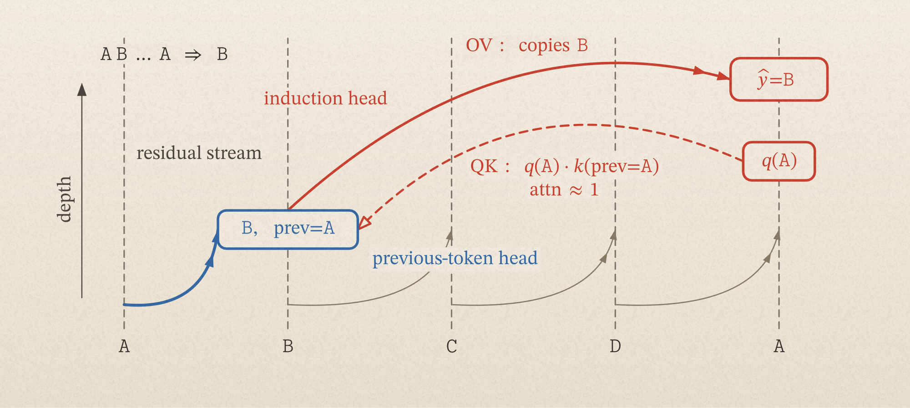

**Claim.** An induction head predicts the next token by attending to the position immediately AFTER an earlier occurrence of the current token — it can do that because a previous-token head has already written 'my predecessor was A' into that position's residual stream, which is exactly the key the induction head's query matches — and then copying whatever token sits there into the output.

_(no EXPOSITION yet)_

[transparent svg](circuits/induction_head_circuit.svg) · [cream svg](circuits/induction_head_circuit_paper.svg) · [readback](circuits/induction_head_circuit.readback.md)

---

### qk_circuit_tensor

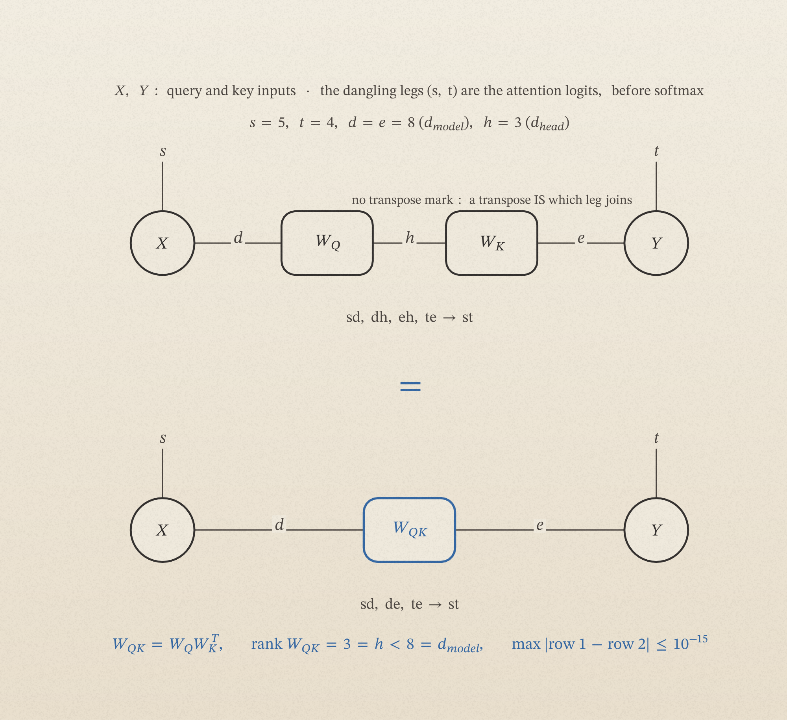

**Claim.** Attention's query and key projections are not two mechanisms: they meet along the head axis, so X W_Q W_K^T X^T and X W_QK X^T are the same array for W_QK = W_Q W_K^T — a single bilinear form of rank 3, the head width, inside an 8-dimensional model.

_(no EXPOSITION yet)_

[transparent svg](circuits/qk_circuit_tensor.svg) · [cream svg](circuits/qk_circuit_tensor_paper.svg) · [readback](circuits/qk_circuit_tensor.readback.md)

---

### schematic_transformer_block

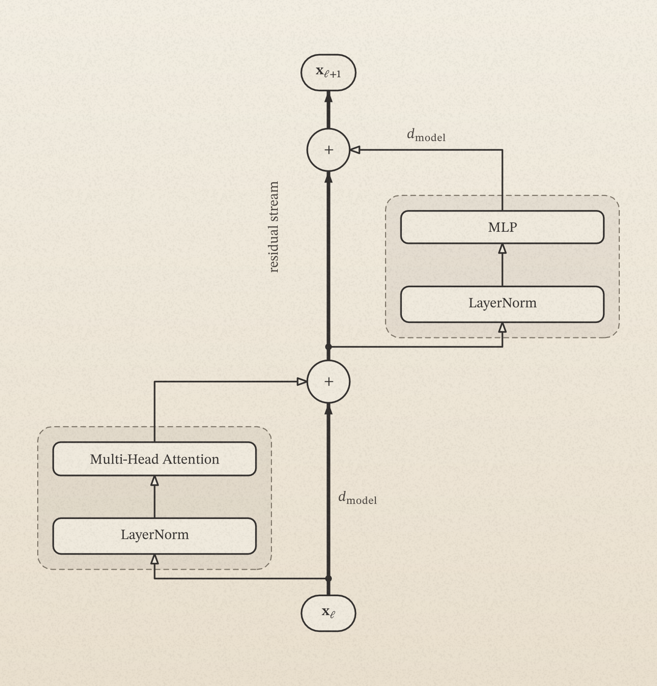

**Claim.** In a pre-norm transformer block the residual stream is the main path and nothing sits on it: attention and the MLP are branches that READ a normalized copy of the stream and ADD their output back, so the LayerNorms never touch what is carried forward and every write is the same d_model width as the stream it is added to.

_(no EXPOSITION yet)_

[transparent svg](circuits/schematic_transformer_block.svg) · [cream svg](circuits/schematic_transformer_block_paper.svg) · [readback](circuits/schematic_transformer_block.readback.md)

---
